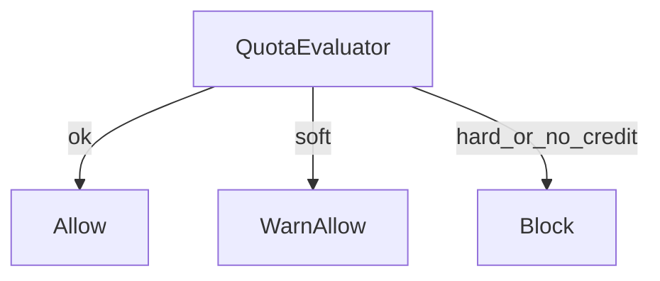

# W5-US04 TDD Guide — Quota + credits

| Field | Value |
|-------|--------|
| **Story** | W5-US04 — Soft/hard quota + credit_balance |
| **Depends on** | W5-US03 |
| **Branch** | `W5-US04` from `wave-5` |
| **Timebox hint** | 1 day |
| **You will touch** | QuotaEvaluator, tenant `quota_config` / `credit_balance` |
| **Architecture refs** | §6.2 Quota Enforcement |
| **KB (create)** | `docs/delivery/kb/W5-US04-quota-credits.md` |
| **Stakeholder TDD** | [`../../WAVE_5_TDD.md`](../../WAVE_5_TDD.md) |
| **AC source** | [`../../../waves/WAVE_5.md`](../../../waves/WAVE_5.md) § W5-US04 |

---

## 1. Overview

Evaluate tenant quota (soft vs hard) and credit balance. Soft → allow + warn stub; hard / zero credit → block signal for US06.

**Done means:** `QuotaEvaluatorTest` green for soft/hard/zero-credit cases.

**Out of scope:** Real notification delivery; HTTP 402 wiring (US06).

---

## 2. Assumptions

| # | Assumption |
|---|------------|
| 1 | `tenants.credit_balance` and `quota_config` columns exist (V1) |
| 2 | Aggregates available for period usage |
| 3 | Soft warn can be log-only in Wave 5 |

```bash
git checkout wave-5 && git pull && git checkout -b W5-US04
```

---

## 3. HLD / DFD



---

## 4. LLD

| Component | Responsibility |
|-----------|----------------|
| `QuotaEvaluator` | Pure decision from config + usage + credit |
| `QuotaDecision` | ALLOW / SOFT_WARN / HARD_BLOCK / NO_CREDIT |
| Optional deduct | On aggregate completion (stub) |

---

## 5. API interface

| Surface | Notes |
|---------|--------|
| (Internal) | US05 exposes quota status; US06 calls evaluator |

---

## 6. Testing

| Layer | Coverage | Tools |
|-------|----------|-------|
| Unit | Threshold matrix | `QuotaEvaluatorTest` |

---

## 7. Risks

| Risk | Mitigation |
|------|------------|
| Ambiguous JSON config | Document schema in KB |
| Race on credit | Single-writer aggregate path |

---

## 8. RED

```bash
./mvnw -pl pipeline-api test -Dtest=QuotaEvaluatorTest
```

**Stop.** Red.

---

## 9. GREEN

1. Evaluator + config parse.
2. Tests for soft/hard/zero.
3. Optional credit deduct hook.

### Checklist

- [ ] Soft vs hard documented
- [ ] Zero credit → block decision
- [ ] Tests green

---

## 10. REFACTOR

- Clear error codes for US06 body
- Share DTO with US05 `/quota`

---

## 11. Docs & trackers

- [ ] KB: how soft/hard limits work
- [ ] Tracker · TEST_MATRIX · `WAVE_5.md` Done

```text
merge → tag W5-US04 → W5-US06
```

---

## 12. Common pitfalls

| Mistake | Fix |
|---------|-----|
| Blocking on soft | Soft must allow |
| Float compare | Use BigDecimal |

## Help / escalate

- Architecture §6.2 · W5-US03 · W5-US06
