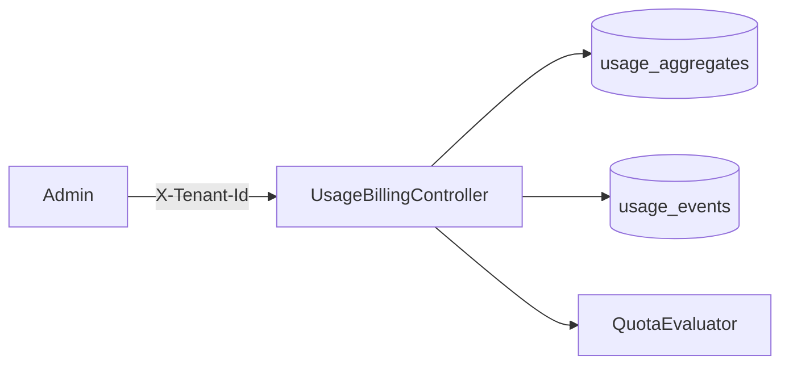

# W5-US05 TDD Guide — Usage / billing query APIs

| Field | Value |
|-------|--------|
| **Story** | W5-US05 — Usage, events, quota query APIs |
| **Depends on** | W5-US03 |
| **Branch** | `W5-US05` from `wave-5` |
| **Timebox hint** | 1–1.5 days |
| **You will touch** | Billing/usage controllers, DTOs, tenant isolation |
| **Architecture refs** | §3.5 Usage and Billing Endpoints |
| **KB (create)** | `docs/delivery/kb/W5-US05-usage-billing-api.md` |
| **Stakeholder TDD** | [`../../WAVE_5_TDD.md`](../../WAVE_5_TDD.md) |
| **AC source** | [`../../../waves/WAVE_5.md`](../../../waves/WAVE_5.md) § W5-US05 |

---

## 1. Overview

Expose tenant-scoped REST for usage summary, raw events, and quota status (billing periods stub OK). Summary must match fixture meters within documented tolerance.

**Done means:** `BillingQueryIT` green; cross-tenant → 404.

**Out of scope:** Invoice PDF; payment provider.

---

## 2. Assumptions

| # | Assumption |
|---|------------|
| 1 | Paths under `/api/v1/tenants/{id}/...` or current-tenant `/api/v1/...` — match §3.5 + platform `X-Tenant-Id` convention |
| 2 | Aggregates from US03 available |
| 3 | Tolerance e.g. ±1% or absolute delta documented in KB |

```bash
git checkout wave-5 && git pull && git checkout -b W5-US05
```

---

## 3. HLD / DFD



---

## 4. LLD

| Component | Responsibility |
|-----------|----------------|
| Controller | Map §3.5 endpoints |
| Service | Assemble summary DTO |
| Isolation | Tenant ownership checks → 404 |

---

## 5. API interface

| Method | Path | Notes |
|--------|------|-------|
| `GET` | `/api/v1/tenants/{id}/usage` | Summary current period |
| `GET` | `/api/v1/tenants/{id}/usage/events` | Paginated raw |
| `GET` | `/api/v1/tenants/{id}/quota` | Quota status |
| `GET` | `/api/v1/tenants/{id}/billing/periods` | Stub/list OK |

Auth: **`X-Tenant-Id`**; cross-tenant → **404**.

---

## 6. Testing

| Layer | Coverage | Tools |
|-------|----------|-------|
| Integration | Summary ± tolerance; isolation | `BillingQueryIT` |
| Manual | curl vs DB | |

---

## 7. Risks

| Risk | Mitigation |
|------|------------|
| Leaking other tenant usage | Strict filters |
| Tolerance fights | Document fixture numbers in KB |

---

## 8. RED

```bash
./mvnw -pl pipeline-api test -Dtest=BillingQueryIT
```

**Stop.** Red.

---

## 9. GREEN

1. Controllers + services.
2. Fixture seed + assert.
3. Isolation tests.

### Checklist

- [x] Usage summary shape matches §3.5
- [x] Cross-tenant 404
- [x] Tolerance documented
- [x] Tests green

---

## 10. REFACTOR

- Align with US04 quota DTO
- Pagination for events

---

## 11. Docs & trackers

- [x] KB: curl examples + dispute checklist
- [x] Tracker · TEST_MATRIX · `WAVE_5.md` Done

```text
merge → tag W5-US05 → W5-US06
```

---

## 12. Common pitfalls

| Mistake | Fix |
|---------|-----|
| 403 instead of 404 | Prefer 404 isolation |
| Skipping `/api/v1` | Match platform convention |

## Help / escalate

- Architecture §3.5 · W5-US03 · W1 tenant filter
