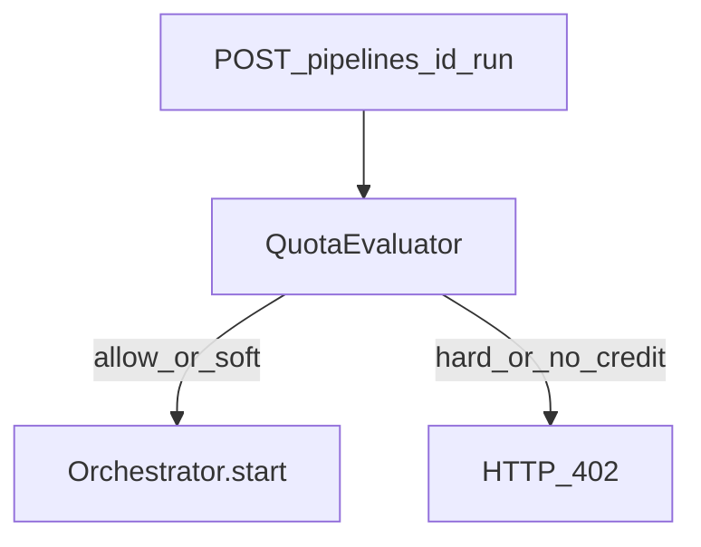

# W5-US06 TDD Guide — Block run with 402

| Field | Value |
|-------|--------|
| **Story** | W5-US06 — Hard limit / zero credit returns `402` on run |
| **Depends on** | W5-US04; W2 `POST .../run` |
| **Branch** | `W5-US06` from `wave-5` |
| **Timebox hint** | 0.5–1 day |
| **You will touch** | Pipeline run path, QuotaEvaluator gate, error body |
| **Architecture refs** | §6.2 Quota Enforcement |
| **KB (create)** | `docs/delivery/kb/W5-US06-run-blocked-402.md` |
| **Stakeholder TDD** | [`../../WAVE_5_TDD.md`](../../WAVE_5_TDD.md) |
| **AC source** | [`../../../waves/WAVE_5.md`](../../../waves/WAVE_5.md) § W5-US06 |

---

## 1. Overview

Before starting a pipeline run, evaluate quota/credit. On hard limit or credit ≤ 0, return HTTP **402** with quota details — do not start execution.

**Done means:** `RunBlockedIT.returns402` green.

**Out of scope:** Soft-limit UX beyond existing warn stub; payment top-up flow.

---

## 2. Assumptions

| # | Assumption |
|---|------------|
| 1 | US04 `QuotaEvaluator` available |
| 2 | W2 run returns 202 on success — keep that for ALLOW/SOFT |
| 3 | 402 body includes reason + optional limits |

```bash
git checkout wave-5 && git pull && git checkout -b W5-US06
```

---

## 3. HLD / DFD



---

## 4. LLD

| Component | Responsibility |
|-----------|----------------|
| Run service gate | Call evaluator before `orchestrator.start` |
| Exception / advice | Map to 402 |
| Response DTO | Quota details |

---

## 5. API interface

| Method | Path | Success | Blocked |
|--------|------|---------|---------|
| `POST` | `/api/v1/pipelines/{id}/run` | 202 | **402** |

---

## 6. Testing

| Layer | Coverage | Tools |
|-------|----------|-------|
| Integration | Zero credit / hard → 402; allow → 202 | `RunBlockedIT` |
| Unit | Gate short-circuits start | mock orchestrator |

---

## 7. Risks

| Risk | Mitigation |
|------|------------|
| Starting job then failing | Check **before** start |
| Soft incorrectly 402 | Only HARD / NO_CREDIT |

---

## 8. RED

```bash
./mvnw -pl pipeline-api test -Dtest=RunBlockedIT
```

**Stop.** Red.

---

## 9. GREEN

1. Gate in run service.
2. 402 mapping.
3. IT green.

### Checklist

- [x] 402 on hard / zero credit
- [x] 202 still works when allowed
- [x] No execution row on block (or document)
- [x] Tests green

---

## 10. REFACTOR

- Shared error shape with other APIs (`RunBlockedResponse`)
- Align message with billing-dispute KB

---

## 11. Docs & trackers

- [x] KB: why run returned 402 / how to unblock
- [x] Tracker · TEST_MATRIX · `WAVE_5.md` Done

```text
merge → tag W5-US06 → wave-5-complete → PR wave-5 → master
```

---

## 12. Common pitfalls

| Mistake | Fix |
|---------|-----|
| Using 403/429 | Architecture specifies **402** |
| Checking after Rabbit publish | Gate first |

## Help / escalate

- Architecture §6.2 · W5-US04 · W2-US04 run API
