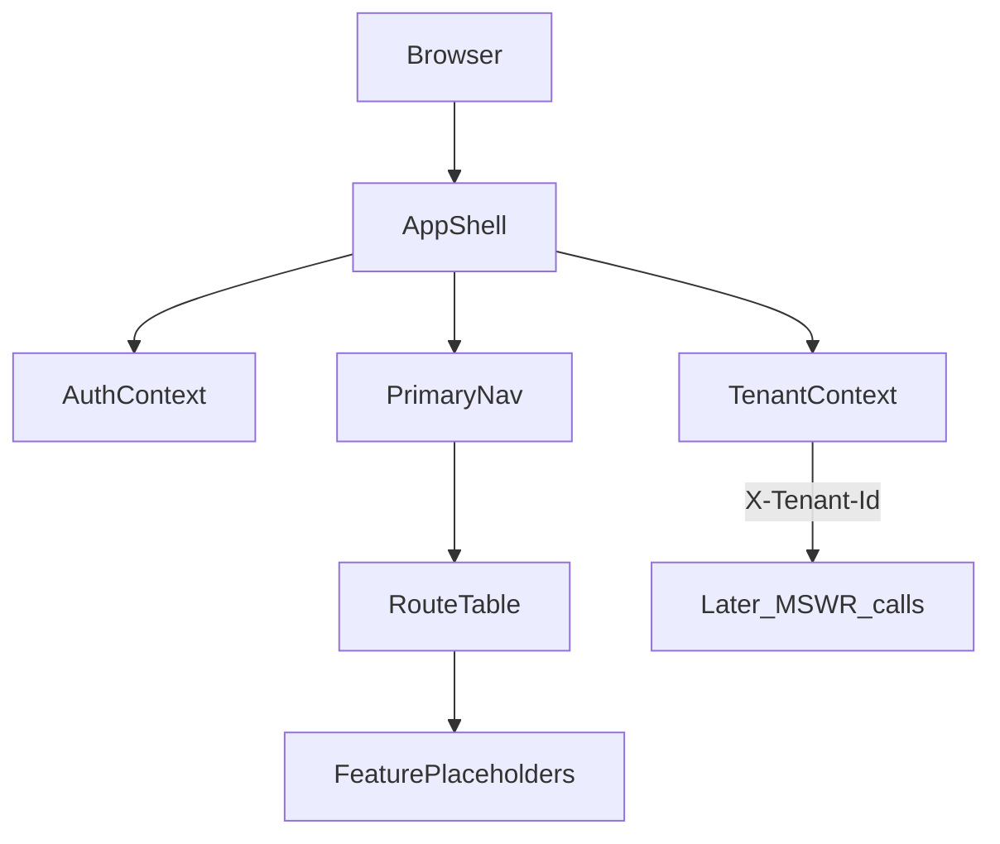

# W6-US01 TDD Guide — Level-1 nav shell + auth/tenant context

| Field | Value |
|-------|--------|
| **Story** | W6-US01 — Level-1 nav shell + auth/tenant context |
| **Depends on** | W1 `X-Tenant-Id` / tenant APIs (stub auth OK) |
| **Branch** | `W6-US01` from `wave-6` |
| **Timebox hint** | 1–1.5 days |
| **You will touch** | New Vite React TS app (`pipeline-ui`), `AuthContext` / `TenantContext`, nav shell, routes |
| **Architecture refs** | §4.1 Level-1 navigation |
| **KB** | [`../../../kb/W6-US01-nav-shell.md`](../../../kb/W6-US01-nav-shell.md) |
| **Stakeholder TDD** | [`../../WAVE_6_TDD.md`](../../WAVE_6_TDD.md) |
| **AC source** | [`../../../waves/WAVE_6.md`](../../../waves/WAVE_6.md) § W6-US01 |

---

## 1. Overview

Scaffold the `pipeline-ui` frontend and prove a tenant user can land in a Level-1 shell with primary nav, tenant session context, and routed placeholder pages — without real IdP login yet.

**Done means:** `AuthContext.test` and shell render test (`Shell.test`) green; nav links route to stub feature pages.

**Out of scope:** Real IdP/OAuth login; L2 sub-nav polish; billing/credit widgets in status bar (stub text OK).

---

## 2. Assumptions

| # | Assumption |
|---|------------|
| 1 | `wave-6` branch exists post Wave 5 merge |
| 2 | Backend optional for US01 — stub tenant picker / header is enough |
| 3 | All later API calls will send `X-Tenant-Id` from `TenantContext` |
| 4 | Stack: React 18 + TypeScript, Vite, Vitest + Testing Library (per architecture §5) |

```bash
git checkout wave-6 && git pull && git checkout -b W6-US01
cd pipeline-ui   # after scaffold
npm install
```

---

## 3. HLD / DFD



Data flow: user picks tenant → context providers wrap app → nav renders L1 items → router shows placeholder content per section.

---

## 4. LLD

| Component | Responsibility |
|-----------|----------------|
| `pipeline-ui/` scaffold | Vite + React 18 + TS; Vitest + Testing Library |
| `AuthContext` | Stub session (logged-in flag, user display name) |
| `TenantContext` | Selected tenant id + setter; persists to `sessionStorage` |
| `AppShell` | Header nav: Pipelets, Pipelines, Connectors, Services, Observability |
| `routes.tsx` | Route table mapping paths → lazy/placeholder pages |
| `apiClient` stub | Reads tenant id from context for future stories |

Suggested layout (mirror §4.1):

```text
pipeline-ui/
  src/
    app/           # shell, routes, providers
    contexts/      # AuthContext, TenantContext
    features/      # empty stubs per nav item
    test/          # setup, render helpers
```

---

## 5. API interface

| Surface | Notes |
|---------|--------|
| (None required US01) | Stub tenant list in UI is OK |
| Future | All `/api/v1/*` calls include `X-Tenant-Id` header from `TenantContext` |

Primary nav targets (routes):

| Nav label | Route (suggested) |
|-----------|-------------------|
| Pipelets | `/pipelets` |
| Pipelines | `/pipelines` |
| Connectors | `/connectors` |
| Services | `/services` |
| Observability | `/observability` |

---

## 6. Testing

| Layer | Coverage | Tools |
|-------|----------|-------|
| Unit | Context default + tenant switch updates consumer | `AuthContext.test.tsx` |
| Component | Shell renders nav links; active route highlights | `Shell.test.tsx` |
| Smoke | `npm run dev` loads shell without console errors | manual |

---

## 7. Risks

| Risk | Mitigation |
|------|------------|
| No frontend module yet | US01 owns scaffold; keep deps minimal |
| Context re-render storms | Split providers; memoize shell children |
| Route drift vs architecture | Match §4.1 labels in KB |

---

## 8. RED

| File | Method / case | Asserts |
|------|---------------|---------|
| `AuthContext.test.tsx` | default tenant / switch tenant | consumer sees new tenant id |
| `Shell.test.tsx` | renders primary nav | Pipelets, Pipelines, Connectors links present |

```bash
cd pipeline-ui
npm test -- AuthContext.test Shell.test
```

**Stop.** Red.

---

## 9. GREEN

1. Scaffold Vite React TS app under `pipeline-ui/`.
2. Implement `AuthContext` + `TenantContext` providers.
3. Build `AppShell` with Level-1 nav per §4.1.
4. Wire route table to placeholder pages.
5. Tests green.

### Checklist

- [x] `pipeline-ui` scaffold committed on branch
- [x] `AuthContext` + `TenantContext` providers
- [x] Level-1 nav + route table
- [x] `AuthContext.test` green
- [x] `Shell.test` green

---

## 10. REFACTOR

- Extract route table to isolated module for US02–US06 feature imports
- Shared `renderWithProviders()` test helper
- Document tenant stub fixtures (`T001`) in KB

---

## 11. Docs & trackers

- [x] KB: nav map, tenant picker behaviour, screenshot placeholder
- [x] Tracker · TEST_MATRIX · `WAVE_6.md` Done

```text
merge → tag W6-US01 → W6-US02
```

---

## 12. Common pitfalls

| Mistake | Fix |
|---------|-----|
| Hard-coding tenant in fetch calls | Always read from `TenantContext` |
| Real login blocking progress | Stub picker in header is in-scope |
| Missing test provider wrapper | Use shared `renderWithProviders` |
| Nav labels ≠ architecture §4.1 | Match Global Pipelets / Pipelines / Connectors / Services / Obs |

## Help / escalate

- Architecture §4.1 · [`WAVE_6_TDD.md`](../../WAVE_6_TDD.md) · W1 `X-Tenant-Id` stub auth
