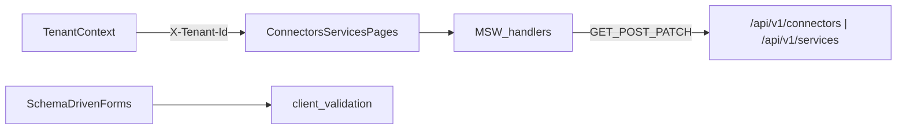

# W6-US02 TDD Guide — Connectors & Services list/forms

| Field | Value |
|-------|--------|
| **Story** | W6-US02 — Connectors & Services list + create/edit forms |
| **Depends on** | W6-US01; W1 connector/service APIs |
| **Branch** | `W6-US02` from `wave-6` |
| **Timebox hint** | 1.5 days |
| **You will touch** | `features/connectors/`, `features/services/`, MSW handlers, form validation |
| **Architecture refs** | §4.5 Connectors; §3.3–3.4 |
| **KB** | [`../../../kb/W6-US02-connectors-services-ui.md`](../../../kb/W6-US02-connectors-services-ui.md) |
| **Stakeholder TDD** | [`../../WAVE_6_TDD.md`](../../WAVE_6_TDD.md) |
| **AC source** | [`../../../waves/WAVE_6.md`](../../../waves/WAVE_6.md) § W6-US02 |

---

## 1. Overview

Build list + create/edit wizards for tenant **connectors** and **services** against MSW-mocked W1 APIs. Secret fields must never be echoed in the UI after save.

**Done means:** form validation tests green; list/detail views render from MSW; secrets redacted or masked on GET.

**Out of scope:** Full ADLS/auth vendor matrix polish; live “Test connection” latency UI (stub result OK).

---

## 2. Assumptions

| # | Assumption |
|---|------------|
| 1 | W6-US01 shell + `TenantContext` merged |
| 2 | W1 exposes `GET/POST/PATCH /api/v1/connectors` and `/api/v1/services` with `X-Tenant-Id` |
| 3 | MSW handlers live under `pipeline-ui/src/mocks/` |
| 4 | W1 redacts secrets on GET (see W1-US04 KB); UI must not log raw secrets |

```bash
git checkout wave-6 && git pull && git checkout -b W6-US02
cd pipeline-ui && npm install
```

---

## 3. HLD / DFD



Data flow: tenant selects connector type → schema-driven form → POST with tenant header → list refresh; GET never displays raw secret values.

---

## 4. LLD

| Component | Responsibility |
|-----------|----------------|
| `features/connectors/` | List, detail/edit, create wizard (type pick → config → optional auth service bind) |
| `features/services/` | Table list + create flow (type → vendor → tenant config) |
| `mocks/handlers/connectors.ts` | CRUD fixtures mirroring W1 DTOs |
| `mocks/handlers/services.ts` | CRUD fixtures; secrets omitted on GET |
| `useConnectors` / `useServices` | TanStack Query hooks (or fetch wrappers) |
| Shared form kit | JSON-schema-ish field renderers; required field validation |

Connectors layout (§4.5): split view — list left, detail/form right.  
Services layout (§4.6): table + create modal/wizard.

---

## 5. API interface

| Method | Path | Notes |
|--------|------|-------|
| `GET` | `/api/v1/connectors` | Tenant-scoped list |
| `POST` | `/api/v1/connectors` | Create instance |
| `GET` | `/api/v1/connectors/{id}` | Detail; secrets redacted |
| `PATCH` | `/api/v1/connectors/{id}` | Update config |
| `GET` | `/api/v1/services` | Tenant-scoped list |
| `POST` | `/api/v1/services` | Create service instance |
| `GET` | `/api/v1/services/{id}` | Detail; sensitive fields masked |

All requests: header `X-Tenant-Id: <tenantId>` from context.

---

## 6. Testing

| Layer | Coverage | Tools |
|-------|----------|-------|
| Unit | Required fields, invalid JSON config | `ConnectorForm.test`, `ServiceForm.test` |
| Component | List renders rows from MSW; create submits payload | Testing Library + MSW |
| Security | GET response with secret → UI shows mask/not value | snapshot or text query |

---

## 7. Risks

| Risk | Mitigation |
|------|------------|
| API contract drift vs W1 | Mirror OpenAPI / W1 IT fixtures in MSW |
| Secrets leaked in devtools | Never `console.log` form state with secrets |
| Large config schemas | Start with Rest + StubAuth fixtures |

---

## 8. RED

| File | Method / case | Asserts |
|------|---------------|---------|
| `ConnectorForm.test.tsx` | submit without required fields | validation errors shown |
| `ServiceForm.test.tsx` | submit without vendor | blocked |
| `ConnectorsList.test.tsx` | renders fixture rows | names visible |
| `ServiceDetail.test.tsx` | GET with redacted secret | raw secret absent from DOM |

```bash
cd pipeline-ui
npm test -- ConnectorForm ServiceForm ConnectorsList ServiceDetail
```

**Stop.** Red.

---

## 9. GREEN

1. MSW handlers for connectors + services.
2. List + create/edit pages wired into US01 routes.
3. Client validation + submit flows.
4. Mask/redact secrets on display.
5. Tests green.

### Checklist

- [ ] MSW handlers for `/api/v1/connectors` and `/api/v1/services`
- [ ] Connector list + wizard
- [ ] Service table + create flow
- [ ] Form validation tests green
- [ ] Secrets never shown in UI after save

---

## 10. REFACTOR

- Shared form field kit for US03–US04 schema-driven panels
- Extract API types from W1 fixture JSON
- Centralize `X-Tenant-Id` in `apiClient`

---

## 11. Docs & trackers

- [ ] KB: create flows, MSW fixtures, screenshot placeholders
- [ ] Tracker · TEST_MATRIX · `WAVE_6.md` Done

```text
merge → tag W6-US02 → W6-US03
```

---

## 12. Common pitfalls

| Mistake | Fix |
|---------|-----|
| Echoing `client_secret` from GET | Show placeholder `••••••` only |
| Missing tenant header | Use `apiClient` wrapper |
| Testing against live backend in CI | MSW in unit/component tests |
| Duplicating W1 validation rules | Client checks required fields; server is source of truth |

## Help / escalate

- Architecture §4.5 · §4.6 · W1-US03/US04 KBs · [`WAVE_6_TDD.md`](../../WAVE_6_TDD.md)
