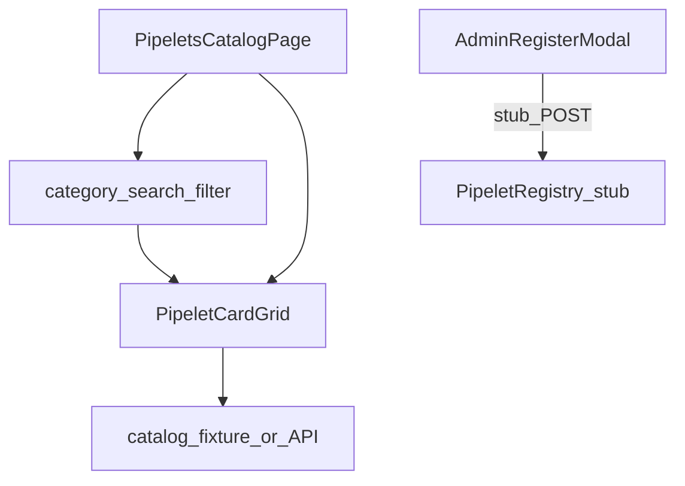

# W6-US03 TDD Guide — Global Pipelets catalog + admin register

| Field | Value |
|-------|--------|
| **Story** | W6-US03 — Global Pipelets catalog + admin register entry |
| **Depends on** | W6-US01; W2 pipelet ids (registry stub OK) |
| **Branch** | `W6-US03` from `wave-6` |
| **Timebox hint** | 1 day |
| **You will touch** | `features/pipelets/`, catalog filter, admin register modal (stub backend OK) |
| **Architecture refs** | §4.2 Pipelets catalog |
| **KB** | [`../../../kb/W6-US03-pipelets-catalog.md`](../../../kb/W6-US03-pipelets-catalog.md) |
| **Stakeholder TDD** | [`../../WAVE_6_TDD.md`](../../WAVE_6_TDD.md) |
| **AC source** | [`../../../waves/WAVE_6.md`](../../../waves/WAVE_6.md) § W6-US03 |

---

## 1. Overview

Browse and filter global pipelet cards (Source / Processor / Destination). Provide admin “Register Pipelet” entry with modal tabs; backend registry may be stubbed if W2 registry is incomplete.

**Done means:** catalog filter tests green; cards render from fixture catalog; admin modal opens and validates required fields (submit may noop/stub).

**Out of scope:** Full binary build/upload pipeline; version history backend.

---

## 2. Assumptions

| # | Assumption |
|---|------------|
| 1 | W6-US01 nav includes Pipelets route |
| 2 | Fixture catalog JSON available (mirror W2 opaque `pipelet_id`s) |
| 3 | Admin role can be stubbed via `AuthContext` flag |
| 4 | Tenant view is read-only browse; admin sees Register button |

```bash
git checkout wave-6 && git pull && git checkout -b W6-US03
cd pipeline-ui && npm install
```

---

## 3. HLD / DFD



Data flow: load catalog → user filters by category/search → cards update; admin opens modal → validates → stub submit.

---

## 4. LLD

| Component | Responsibility |
|-----------|----------------|
| `PipeletsCatalogPage` | L2 sub-nav: Source \| Processor \| Destination |
| `PipeletCard` | Icon, name, category badge, version, runtime badge, snippet |
| `usePipeletCatalog` | Load fixture or `GET /api/v1/pipelets` when available |
| `catalogFilter` | Pure filter by category + search string |
| `RegisterPipeletModal` | Tabs: Image Path \| Image URL \| Runtime Binary (§4.2) |
| `roleGate` helper | Show Register only for admin stub |

Card click (optional US03): detail drawer with config schema preview + “Add to Pipeline” shortcut (link to US04).

---

## 5. API interface

| Method | Path | Notes |
|--------|------|-------|
| `GET` | `/api/v1/pipelets` | Global + tenant-private catalog (stub fixture OK) |
| `POST` | `/api/v1/pipelets/register` | Admin register (may MSW stub until registry ready) |

If registry incomplete: ship static `fixtures/pipelets.json` and document swap path in KB.

---

## 6. Testing

| Layer | Coverage | Tools |
|-------|----------|-------|
| Unit | `catalogFilter` category + text search | `catalogFilter.test.ts` |
| Component | Grid shows N cards; filter reduces count | `PipeletsCatalog.test.tsx` |
| Component | Admin modal required fields | `RegisterPipeletModal.test.tsx` |

Prefer pure filter unit tests over DOM drag in CI.

---

## 7. Risks

| Risk | Mitigation |
|------|------------|
| Registry incomplete | Fixture catalog + opaque ids from W2 |
| Admin vs tenant confusion | Clear role stub + KB |
| Category enum drift | Align with architecture Source/Processor/Destination |

---

## 8. RED

| File | Method / case | Asserts |
|------|---------------|---------|
| `catalogFilter.test.ts` | filter by category `Source` | only sources returned |
| `catalogFilter.test.ts` | search by name substring | matching cards only |
| `PipeletsCatalog.test.tsx` | default render | ≥ 1 card visible |
| `PipeletsCatalog.test.tsx` | apply filter | card count decreases |

```bash
cd pipeline-ui
npm test -- catalogFilter PipeletsCatalog
```

**Stop.** Red.

---

## 9. GREEN

1. Catalog fixture + filter pure function.
2. Card grid + sub-nav tabs.
3. Admin register modal (stub submit).
4. Filter + render tests green.

### Checklist

- [x] Pipelet card grid with category sub-nav
- [x] `catalogFilter` unit tests green
- [x] Catalog component filter tests green
- [x] Admin register modal (stub backend OK)
- [x] KB documents fixture → live API swap

---

## 10. REFACTOR

- Extract `roleGate` for US04 admin-only actions
- Share badge components with builder palette (US04)
- Move catalog types to shared `types/pipelet.ts`

---

## 11. Docs & trackers

- [x] KB: catalog filters, admin tabs, screenshot placeholders
- [x] Tracker · TEST_MATRIX · `WAVE_6.md` Done

```text
merge → tag W6-US03 → W6-US04
```

---

## 12. Common pitfalls

| Mistake | Fix |
|---------|-----|
| Blocking on real registry API | Stub catalog is in-scope |
| Filter logic in component only | Pure `catalogFilter` for testability |
| Missing runtime/category badges | Match §4.2 card layout |
| Register submit breaks CI | MSW 201 stub acceptable |

## Help / escalate

- Architecture §4.2 · W2 pipelet fixtures · [`WAVE_6_TDD.md`](../../WAVE_6_TDD.md)
