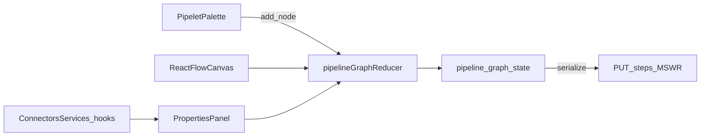

# W6-US04 TDD Guide — Drag-drop pipeline builder save (React Flow)

| Field | Value |
|-------|--------|
| **Story** | W6-US04 — Drag-drop pipeline builder save (React Flow) |
| **Depends on** | W6-US03; W2 pipeline + steps APIs |
| **Branch** | `W6-US04` from `wave-6` |
| **Timebox hint** | 2 days |
| **You will touch** | `features/pipelines/builder/`, React Flow canvas, `pipelineGraphReducer`, save API |
| **Architecture refs** | §4.3 Pipeline builder (§4.4 canvas detail) |
| **KB** | [`../../../kb/W6-US04-pipeline-builder.md`](../../../kb/W6-US04-pipeline-builder.md) |
| **Stakeholder TDD** | [`../../WAVE_6_TDD.md`](../../WAVE_6_TDD.md) |
| **AC source** | [`../../../waves/WAVE_6.md`](../../../waves/WAVE_6.md) § W6-US04 |

---

## 1. Overview

Implement the no-code canvas: drag pipelets from palette, connect three stages, bind connectors/services in properties panel, and **save** via W2 `POST /pipelines` + `PUT .../steps` (MSW mock in tests).

**Done means:** `pipelineGraphReducer.test` green; save handler sends expected graph JSON to mocked API; manual smoke can build 3-step pipeline.

**Out of scope:** Advanced auto-routing; collaborative editing; real K8s resource picker polish.

---

## 2. Assumptions

| # | Assumption |
|---|------------|
| 1 | W6-US03 catalog supplies palette items |
| 2 | W6-US02 connector/service dropdowns reusable in properties panel |
| 3 | `threeStage` pipeline JSON fixture mirrors backend (see WAVE_6_TDD) |
| 4 | React Flow installed; prefer unit reducer tests over DOM drag in CI |

```bash
git checkout wave-6 && git pull && git checkout -b W6-US04
cd pipeline-ui && npm install
```

---

## 3. HLD / DFD



Data flow: add node → reducer updates graph → user connects edges → properties bind connector/service ids → Save serializes to W2 steps payload.

---

## 4. LLD

| Component | Responsibility |
|-----------|----------------|
| `pipelineGraphReducer` | Pure actions: `ADD_NODE`, `CONNECT`, `UPDATE_STEP`, `REMOVE_NODE` |
| `graphToStepsPayload` | Map React Flow nodes/edges → W2 steps JSON |
| `PipelineBuilderPage` | Three-panel layout: palette \| canvas \| properties (§4.4) |
| `PipeletPalette` | Drag sources from US03 catalog |
| `StepPropertiesPanel` | Schema-driven fields + connector/service dropdowns |
| `useSavePipeline` | `POST /api/v1/pipelines` then `PUT .../steps` |
| MSW save handlers | Assert payload shape in tests |

Target: **3 stages** connected source → processor → destination.

---

## 5. API interface

| Method | Path | Notes |
|--------|------|-------|
| `POST` | `/api/v1/pipelines` | Create draft pipeline |
| `PUT` | `/api/v1/pipelines/{id}/steps` | Replace steps from graph |
| `GET` | `/api/v1/pipelines/{id}` | Load for edit (optional US04) |
| `GET` | `/api/v1/connectors` | Populate properties dropdowns |
| `GET` | `/api/v1/services` | Populate properties dropdowns |

Headers: `X-Tenant-Id` on all calls.

Example save flow:

1. Create pipeline `{ name, mode: "async" }`.
2. `PUT .../steps` with ordered steps, each with `pipelet_id`, config, connector/service refs.

---

## 6. Testing

| Layer | Coverage | Tools |
|-------|----------|-------|
| Unit | Reducer add/connect/update; serialize 3-step graph | `pipelineGraphReducer.test.ts` |
| Unit | `graphToStepsPayload` matches fixture | same file or dedicated test |
| Integration | Save button → MSW receives expected body | `PipelineBuilder.save.test.tsx` |
| Manual | Drag 3 nodes, save, reload | KB script |

Avoid flaky DOM drag in CI; test reducer + serializer primarily.

---

## 7. Risks

| Risk | Mitigation |
|------|------------|
| Canvas flakiness in CI | Unit graph tests; limit drag E2E |
| Graph ↔ API shape mismatch | Mirror W2 `PipelineRunIT` steps fixture |
| React Flow learning curve | Timebox; follow official minimal example |

---

## 8. RED

| File | Method / case | Asserts |
|------|---------------|---------|
| `pipelineGraphReducer.test.ts` | ADD_NODE × 3 + CONNECT × 2 | 3 nodes, 2 edges |
| `pipelineGraphReducer.test.ts` | graphToStepsPayload | 3 steps, ordered, pipelet ids set |
| `PipelineBuilder.save.test.tsx` | click Save | MSW `PUT .../steps` called with fixture shape |

```bash
cd pipeline-ui
npm test -- pipelineGraphReducer PipelineBuilder.save
```

**Stop.** Red.

---

## 9. GREEN

1. Reducer + graph types.
2. React Flow canvas wired to reducer.
3. Properties panel with connector/service binds.
4. Save mutation + MSW handlers.
5. Tests green.

### Checklist

- [ ] `pipelineGraphReducer` with add/connect/update actions
- [ ] React Flow three-panel builder
- [ ] Properties panel binds connectors/services
- [ ] Save → `POST` pipeline + `PUT` steps (MSW)
- [ ] `pipelineGraphReducer.test` green
- [ ] Save mock integration test green

---

## 10. REFACTOR

- Pure graph transforms isolated from React Flow components
- Share palette data loader with US03 catalog
- Extract step config form from US02 field kit

---

## 11. Docs & trackers

- [ ] KB: builder layout, save sequence, `threeStage` fixture, screenshots
- [ ] Tracker · TEST_MATRIX · `WAVE_6.md` Done

```text
merge → tag W6-US04 → W6-US05
```

---

## 12. Common pitfalls

| Mistake | Fix |
|---------|-----|
| Testing drag in CI | Test reducer + serializer instead |
| Unordered steps on save | Explicit topological sort by edges |
| Missing queue names on edges | Display stub queue labels per §4.4 |
| Saving without tenant header | Use shared `apiClient` |

## Help / escalate

- Architecture §4.3–§4.4 · W2-US02/US03 steps APIs · [`WAVE_6_TDD.md`](../../WAVE_6_TDD.md)
