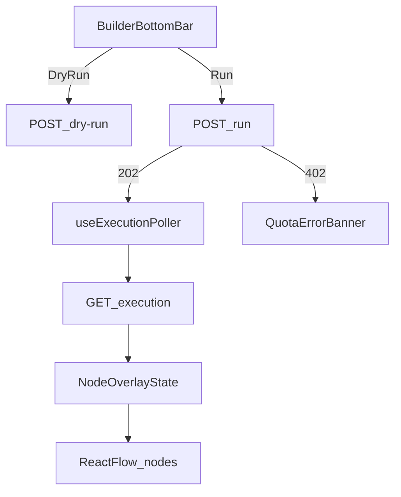

# W6-US05 TDD Guide — Run / dry-run / execution overlay

| Field | Value |
|-------|--------|
| **Story** | W6-US05 — Run / dry-run / execution overlay |
| **Depends on** | W6-US04; W2-US04 run API; W5-US06 HTTP 402 handling |
| **Branch** | `W6-US05` from `wave-6` |
| **Timebox hint** | 1.5 days |
| **You will touch** | Run/dry-run actions, execution poller, canvas overlay state, 402 error UI |
| **Architecture refs** | §4.3 execution overlay (§4.4 builder bottom bar) |
| **KB** | [`../../../kb/W6-US05-run-overlay.md`](../../../kb/W6-US05-run-overlay.md) |
| **Stakeholder TDD** | [`../../WAVE_6_TDD.md`](../../WAVE_6_TDD.md) |
| **AC source** | [`../../../waves/WAVE_6.md`](../../../waves/WAVE_6.md) § W6-US05 |

---

## 1. Overview

Wire **Dry Run** and **Run** on the builder bottom bar. Poll W2 execution status and paint node overlay colours (running / completed / failed). Surface W5 **402** quota/credit blocks clearly in the UI.

**Done means:** overlay state tests green; documented manual E2E script (or Playwright) passes happy path; 402 shows user-visible error.

**Out of scope:** Full log tail UI (link to observability OK); accurate inline metrics until W4 data wired.

---

## 2. Assumptions

| # | Assumption |
|---|------------|
| 1 | W6-US04 save flow produces an `active` pipeline with 3 steps |
| 2 | W2 `POST .../run` returns `202` + `execution_id`; `GET .../executions/{id}` returns status |
| 3 | W5 returns **402** with quota body on hard block / zero credit (see W5-US06 KB) |
| 4 | Dry-run endpoint may be stubbed (`POST .../dry-run`) if backend partial |

```bash
git checkout wave-6 && git pull && git checkout -b W6-US05
cd pipeline-ui && npm install
```

---

## 3. HLD / DFD



Data flow: Run → execution id → poll until terminal → map step statuses to node colours; 402 short-circuits with banner/modal.

---

## 4. LLD

| Component | Responsibility |
|-----------|----------------|
| `useExecutionPoller` | Interval/refetch `GET .../executions/{id}` until terminal |
| `executionOverlayReducer` | Map execution step status → per-node visual state |
| `RunControls` | Dry Run \| Save \| Run buttons (§4.4 bottom bar) |
| `ExecutionOverlay` | Node border colours + optional status chips |
| `QuotaBlockedAlert` | Parse 402 body; show hard vs no-credit message |
| MSW handlers | Run 202, status progression, 402 fixture |

Overlay colours (suggested): green=running, blue=completed, red=failed, grey=pending.

---

## 5. API interface

| Method | Path | Notes | Response |
|--------|------|-------|----------|
| `POST` | `/api/v1/pipelines/{id}/dry-run` | Validate config | `200` validation result |
| `POST` | `/api/v1/pipelines/{id}/run` | Start async run | `202` + `execution_id` |
| `POST` | `/api/v1/pipelines/{id}/run` | Quota blocked | **402** + quota details |
| `GET` | `/api/v1/pipelines/{id}/executions/{executionId}` | Poll status | `200` step statuses |

402 body (from W5-US06 KB): include decision code (`HARD_BLOCK`, `NO_CREDIT`) for messaging.

---

## 6. Testing

| Layer | Coverage | Tools |
|-------|----------|-------|
| Unit | Overlay reducer maps statuses → node states | `executionOverlayReducer.test.ts` |
| Component | Poller transitions pending → running → completed | `ExecutionOverlay.test.tsx` + MSW |
| Component | 402 response renders quota banner | `RunControls.quota.test.tsx` |
| E2E / manual | Save 3-step → Run → overlay completes | Playwright or KB script |

Per working agreements: Playwright **or** documented manual equivalent until E2E harness exists.

---

## 7. Risks

| Risk | Mitigation |
|------|------------|
| E2E harness late | KB manual script as interim DoD |
| Poll interval too aggressive | Backoff; stop on terminal |
| 402 conflated with 4xx generic | Dedicated quota UI component |
| Step index ↔ node id mismatch | Stable node ids in graph reducer |

---

## 8. RED

| File | Method / case | Asserts |
|------|---------------|---------|
| `executionOverlayReducer.test.ts` | RUNNING/COMPLETED/FAILED steps | correct node states |
| `ExecutionOverlay.test.tsx` | poll returns completed | nodes show completed style |
| `RunControls.quota.test.tsx` | run returns 402 | quota message visible |

```bash
cd pipeline-ui
npm test -- executionOverlayReducer ExecutionOverlay RunControls.quota
```

**Stop.** Red.

---

## 9. GREEN

1. Run + dry-run buttons wired to API.
2. Poller hook with MSW status sequence.
3. Overlay reducer + canvas styling.
4. 402 error surface.
5. Tests green + manual/E2E script in KB.

### Checklist

- [x] Dry Run + Run buttons on builder bar
- [x] `useExecutionPoller` stops on terminal status
- [x] Node overlay colours driven by execution state
- [x] HTTP 402 shows clear quota/credit message
- [x] Overlay state tests green
- [x] Manual E2E script (or Playwright) documented and passing

---

## 10. REFACTOR

- Shared poller hook reusable in US06 dashboards
- Extract API error parser for 402 vs 400 vs 404
- Debounce overlay updates to reduce re-renders

---

## 11. Docs & trackers

- [x] KB: run/dry-run steps, 402 troubleshooting, manual E2E script, screenshots
- [x] Tracker · TEST_MATRIX · `WAVE_6.md` Done

```text
merge → tag W6-US05 → W6-US06
```

---

## 12. Common pitfalls

| Mistake | Fix |
|---------|-----|
| Treating 402 as generic error | Parse W5 quota body; user-friendly copy |
| Infinite poll loop | Terminal states + max attempts |
| Overlay without saved pipeline | Ensure pipeline `active` before Run |
| Soft quota shown as block | 402 only for hard / no credit |

## Help / escalate

- Architecture §4.3–§4.4 · W2-US04 · W5-US06 KB · [`WAVE_6_TDD.md`](../../WAVE_6_TDD.md)
