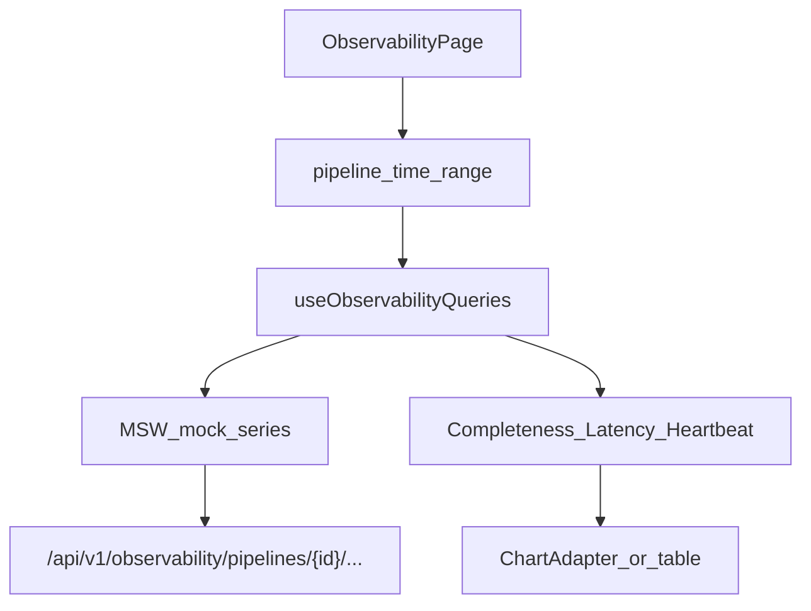

# W6-US06 TDD Guide — Observability panels (Should)

| Field | Value |
|-------|--------|
| **Story** | W6-US06 — Observability panels in UI |
| **Depends on** | W6-US05; W4 observability REST |
| **Branch** | `W6-US06` from `wave-6` |
| **Timebox hint** | 1 day |
| **Priority** | Should |
| **You will touch** | `features/observability/`, completeness/latency/heartbeat widgets, chart adapters |
| **Architecture refs** | §4.6 Observability; §3.6 |
| **KB** | [`../../../kb/W6-US06-observability-panels.md`](../../../kb/W6-US06-observability-panels.md) |
| **Stakeholder TDD** | [`../../WAVE_6_TDD.md`](../../WAVE_6_TDD.md) |
| **AC source** | [`../../../waves/WAVE_6.md`](../../../waves/WAVE_6.md) § W6-US06 |

---

## 1. Overview

Add Observability section panels: **Completeness**, **Latency**, and **Heartbeat** widgets fed by W4 `/api/v1/observability/...` endpoints (MSW mock series in tests).

**Done means:** panel render tests green with mock time series; pipeline selector + time range controls wired; optional defer with tracker note if wave exits early.

**Out of scope:** Live Grafana iframe embed (link out OK); full critical-errors log tail UI.

---

## 2. Assumptions

| # | Assumption |
|---|------------|
| 1 | W6-US01 Observability nav route exists |
| 2 | W4 exposes tenant-scoped observability REST (see W4-US05) |
| 3 | W6-US05 provides pipeline list context or reuse pipelines API |
| 4 | Chart library optional — simple table/sparkline OK for Should story |

```bash
git checkout wave-6 && git pull && git checkout -b W6-US06
cd pipeline-ui && npm install
```

---

## 3. HLD / DFD



Data flow: user picks pipeline + range → parallel fetch completeness/latency/heartbeat → panels render series; errors show inline banner.

---

## 4. LLD

| Component | Responsibility |
|-----------|----------------|
| `ObservabilityPage` | L2 sub-nav: Completeness \| Latency \| Heartbeat \| Critical Errors (stub) |
| `CompletenessPanel` | Line/table: completeness % over time + execution table |
| `LatencyPanel` | Percentile summary or heatmap stub |
| `HeartbeatPanel` | Last heartbeat timestamp + status indicator |
| `useObservabilityQueries` | TanStack Query wrappers per endpoint |
| `ChartAdapter` | Isolate chart lib; easy swap for tests |
| MSW fixtures | Mock series JSON mirroring W4 IT shapes |

Align with architecture §4.7 layout where practical (pipeline selector, time range, alert banner if completeness &lt; threshold).

---

## 5. API interface

| Method | Path | Notes |
|--------|------|-------|
| `GET` | `/api/v1/observability/pipelines/{id}/completeness` | Ratio/pct + records in/out |
| `GET` | `/api/v1/observability/pipelines/{id}/latency` | p50/p95/p99 or summary |
| `GET` | `/api/v1/observability/pipelines/{id}/heartbeat` | Last heartbeat |
| `GET` | `/api/v1/observability/pipelines/{id}/errors` | Critical error summary (optional) |
| `GET` | `/api/v1/pipelines` | Pipeline selector dropdown |

All requests: `X-Tenant-Id` header.

---

## 6. Testing

| Layer | Coverage | Tools |
|-------|----------|-------|
| Component | Completeness panel renders mock series | `CompletenessPanel.test.tsx` |
| Component | Latency panel shows percentile labels | `LatencyPanel.test.tsx` |
| Component | Heartbeat panel shows timestamp | `HeartbeatPanel.test.tsx` |
| MSW | Handlers return W4-shaped JSON | shared mock module |

---

## 7. Risks

| Risk | Mitigation |
|------|------------|
| Should story deferred at wave exit | Tracker note + stub page OK |
| Chart lib bundle size | Start with tables; add charts in refactor |
| W4 API shape drift | Copy W4 `ObservabilityControllerIT` fixtures |
| Empty state UX | Show “no executions” when series empty |

---

## 8. RED

| File | Method / case | Asserts |
|------|---------------|---------|
| `CompletenessPanel.test.tsx` | mock completeness series | % values visible in DOM |
| `LatencyPanel.test.tsx` | mock latency summary | p95 label present |
| `HeartbeatPanel.test.tsx` | mock heartbeat | last-seen text rendered |

```bash
cd pipeline-ui
npm test -- CompletenessPanel LatencyPanel HeartbeatPanel
```

**Stop.** Red.

---

## 9. GREEN

1. Observability page + sub-nav tabs.
2. MSW handlers for W4 endpoints.
3. Three panels with pipeline/range selectors.
4. Panel render tests green.

### Checklist

- [ ] Observability route with sub-nav tabs
- [ ] MSW mock series for completeness/latency/heartbeat
- [ ] Pipeline selector + time range controls
- [ ] Completeness panel render test green
- [ ] Latency panel render test green
- [ ] Heartbeat panel render test green

---

## 10. REFACTOR

- Chart adapter isolation for future Grafana/link-out
- Share query hooks with US05 execution detail links
- Extract observability types from W4 fixtures

---

## 11. Docs & trackers

- [ ] KB: panel descriptions, mock data shapes, screenshot placeholders
- [ ] Tracker · TEST_MATRIX · `WAVE_6.md` Done (or deferred note if Should skipped)

```text
merge → tag W6-US06 → wave-6 exit
```

---

## 12. Common pitfalls

| Mistake | Fix |
|---------|-----|
| Calling Prometheus directly from browser | Use W4 REST BFF only |
| Missing tenant header | Same `apiClient` as US01 |
| Over-building charts for Should | Tables + sparklines sufficient |
| Hard-coded pipeline id | Selector from `/api/v1/pipelines` |

## Help / escalate

- Architecture §4.6–§4.7 · §3.6 · W4-US05 · [`WAVE_6_TDD.md`](../../WAVE_6_TDD.md)
