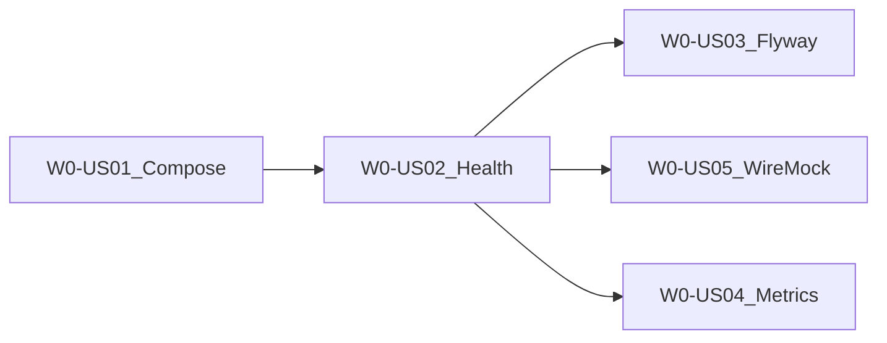
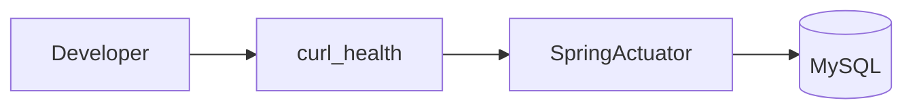

# Wave 0 — Foundation (Execution Plan)

**Branch:** `wave-0`  
**Parent catalog:** [`../../DELIVERY_PLAN.md`](../../DELIVERY_PLAN.md)  
**Trackers:** [`../WAVE_TRACKER.md`](../WAVE_TRACKER.md) · [`../TEST_MATRIX.md`](../TEST_MATRIX.md)  
**Story AC template:** [`../STORY_TEMPLATE.md`](../STORY_TEMPLATE.md)  
**Architecture:** [`../../ARCHITECTURE.md`](../../ARCHITECTURE.md) §5, §10.6

---

## Wave goal

A developer can run the local foundation stack and verify health + tests without any business APIs (tenant/pipeline/connector) yet.

| Exit criterion | How verified |
|----------------|--------------|
| Compose stack healthy | `docker compose up -d` + healthchecks / smoke script |
| LocalStack S3/SQS | Reachable on `localhost:4566`; smoke list/create |
| Spring Boot health | `GET /actuator/health` → `UP` |
| Flyway baseline | Migration applied on start / IT |
| Test harness | Unit + Testcontainers IT green; WireMock stub + fixtures |
| Metrics/logs (Should) | Prometheus scrape + structured log line |

---

## Scope

### In scope (Feature W0-F1)

| Epic | Stories |
|------|---------|
| **W0-F1-E1** Compose stack | W0-US01 |
| **W0-F1-E2** Spring Boot + Flyway | W0-US02, W0-US03 |
| **W0-F1-E3** Observability baseline | W0-US04 |
| **W0-F1-E4** Test harness | W0-US05 |

### Out of scope

- Tenant / connector / pipeline business APIs (Wave 1+)
- K8s Jobs, webhook ingress, billing, UI
- Full ELK/Grafana (Micrometer + optional Compose stubs only)

---

## Target layout

```text
pipeline-platform/
  docker-compose.yml
  scripts/smoke-localstack.sh
  pom.xml                          # parent (Maven, Java 21)
  pipeline-api/
    pom.xml
    src/main/java/.../PipelineApiApplication.java
    src/main/resources/application.yml
    src/main/resources/db/migration/V1__baseline.sql
    src/main/resources/logback-spring.xml
    src/test/java/.../
    src/test/resources/fixtures/
  docs/delivery/waves/WAVE_0.md    # this file
  docs/delivery/kb/W0-*.md
```

**Build tool:** Maven · **Spring Boot:** 3.x · **Java:** 21

---

## Delivery sequence



1. **W0-US01** Compose + LocalStack smoke  
2. **W0-US02** Health API + Testcontainers MySQL IT (fully worked example below)  
3. **W0-US03** Flyway baseline  
4. **W0-US05** Mock-data + WireMock harness  
5. **W0-US04** Structured logging + Prometheus (Should)

---

## Story backlog (full AC)

---

### W0-US01 — Compose stack + LocalStack healthy

| Field | Value |
|-------|--------|
| **Wave / Feature / Epic** | W0 / W0-F1 / W0-F1-E1 |
| **Priority** | Must |
| **Dependencies** | — |
| **Architecture refs** | §5, §10.6 LocalStack |
| **Status** | Done |

**As a** platform developer  
**I want** a Docker Compose stack with MySQL, RabbitMQ, and LocalStack  
**so that** I can run local deps without cloud accounts.

**In scope:** Compose services, healthchecks, LocalStack `s3,sqs`, smoke script.  
**Out of scope:** App container; ELK required (optional stub only).

#### TDD

| Step | Evidence |
|------|----------|
| **Red** | `LocalStackSmokeIT` or script assert fails before Compose exists |
| **Green** | Compose up; smoke script exits 0 |
| **Refactor** | Document ports in README; keep smoke idempotent |

#### Unit tests

| Under test | Assertions | Fixtures |
|------------|------------|----------|
| Port/config constants (optional) | Compose env defaults documented | n/a |

Compose smoke may be **script + Manual** with IT optional later.

#### Integration / smoke

| Test | Stack | Assertions |
|------|-------|------------|
| `scripts/smoke-localstack.sh` | LocalStack | `awslocal s3 mb` / list succeeds |
| Manual MySQL/RabbitMQ | Compose | `mysqladmin ping`, RabbitMQ management UI or `rabbitmq-diagnostics ping` |

#### Mock data / LocalStack

| Dependency | Tool | Notes |
|------------|------|-------|
| S3, SQS | LocalStack host `:4567` → container `:4566` | Default host port avoids clashes; override with `LOCALSTACK_HOST_PORT` / `LOCALSTACK_ENDPOINT` |
| WireMock | n/a | |

#### Manual test steps

| # | Action | Expected |
|---|--------|----------|
| 1 | `docker compose up -d` | Containers healthy |
| 2 | `./scripts/smoke-localstack.sh` | Exit 0 |
| 3 | Open RabbitMQ mgmt `15672` (guest/guest) | UI loads |

**Teardown:** `docker compose down -v`

#### Support KB

See [`../kb/W0-US01-local-compose-stack.md`](../kb/W0-US01-local-compose-stack.md)

---

### W0-US02 — Spring Boot health + Testcontainers MySQL (fully worked)

| Field | Value |
|-------|--------|
| **Wave / Feature / Epic** | W0 / W0-F1 / W0-F1-E2 |
| **Priority** | Must |
| **Dependencies** | W0-US01 (Compose for manual; Testcontainers for CI) |
| **Architecture refs** | §5 Spring Boot |
| **Status** | Todo |

**As a** platform developer  
**I want** a Spring Boot API with a health endpoint tested against MySQL  
**so that** I can prove the application boots and connects to the DB in CI and locally.

**In scope:** `PipelineApiApplication`, Actuator `/actuator/health`, Testcontainers MySQL IT, `application.yml` profiles (`local`, `test`).  
**Out of scope:** Business REST resources; security.

#### TDD

| Step | Evidence |
|------|----------|
| **Red** | `HealthControllerIT.health_returnsUp` fails (no app / no context) |
| **Green** | Minimal Boot app + Actuator; IT green with Testcontainers |
| **Refactor** | Split `application-local.yml` vs `application-test.yml` |

#### Unit tests

| Under test | Assertions | Fixtures |
|------------|------------|----------|
| Context loads smoke (or small util) | Application context not null | — |

Prefer IT for health; unit optional for pure helpers.

#### Integration tests

| Test | Stack | Assertions |
|------|-------|------------|
| `HealthControllerIT` | `@SpringBootTest` + `MOCK`/`RANDOM_PORT` + Testcontainers MySQL | `GET /actuator/health` → 200, status `UP`; DB indicator up if exposed |

#### Mock data service

| Factory | Entity | Location |
|---------|--------|----------|
| Reserved for Wave 1 | — | `src/test/resources/fixtures/tenants/t001.json` placeholder OK |

#### Mock server / LocalStack

| Dependency | Tool | Notes |
|------------|------|-------|
| MySQL | Testcontainers | Prefer over Compose for CI |
| LocalStack | n/a for this story | |

#### Manual test steps

| # | Action | Expected |
|---|--------|----------|
| 1 | Start Compose MySQL (or use IT only) | MySQL healthy |
| 2 | `./mvnw -pl pipeline-api spring-boot:run -Dspring-boot.run.profiles=local` | App starts |
| 3 | `curl localhost:8080/actuator/health` | `"status":"UP"` |

**Teardown:** Stop app; leave Compose running or `down`.

#### Support KB

See [`../kb/W0-US02-health-endpoint.md`](../kb/W0-US02-health-endpoint.md)

##### Dataflow (support)



---

### W0-US03 — Flyway baseline schema applies cleanly

| Field | Value |
|-------|--------|
| **Wave / Feature / Epic** | W0 / W0-F1 / W0-F1-E2 |
| **Priority** | Must |
| **Dependencies** | W0-US02 |
| **Architecture refs** | §2 Data Model (stub) |
| **Status** | Todo |

**As a** platform developer  
**I want** Flyway to apply a baseline migration on startup  
**so that** schema evolution is versioned from day one.

**In scope:** `V1__baseline.sql` with minimum `tenants` stub (id, name, slug, status, created_at) matching architecture naming; Flyway enabled; IT asserting table exists.  
**Out of scope:** Full schema for pipelines/connectors (Wave 1+).

#### TDD

| Step | Evidence |
|------|----------|
| **Red** | `FlywayBaselineIT.tenantsTable_exists` fails |
| **Green** | `V1__baseline.sql` + Flyway config |
| **Refactor** | Align column types with architecture §2 tenants |

#### Unit / Integration

| Test | Assertions |
|------|------------|
| `FlywayBaselineIT` | After context load, `INFORMATION_SCHEMA` / JdbcTemplate shows `tenants` |

#### Manual

| # | Action | Expected |
|---|--------|----------|
| 1 | Boot app against Compose MySQL | Logs show Flyway migrate success |
| 2 | `SHOW TABLES` | `tenants`, `flyway_schema_history` |

#### Mock / LocalStack

n/a

#### Support KB

Short note in W0-US02 KB or `W0-US03-flyway-baseline.md`: how to check migrations applied.

---

### W0-US04 — Structured logging + Micrometer smoke

| Field | Value |
|-------|--------|
| **Wave / Feature / Epic** | W0 / W0-F1 / W0-F1-E3 |
| **Priority** | Should |
| **Dependencies** | W0-US02 |
| **Architecture refs** | §5, §7 (baseline only) |
| **Status** | Todo |

**As a** platform operator  
**I want** JSON-ish structured logs and a Prometheus scrape endpoint  
**so that** Wave 4 observability has a baseline to build on.

#### TDD / tests

| Test | Assertions |
|------|------------|
| `PrometheusEndpointIT` | `GET /actuator/prometheus` contains `jvm_memory_used_bytes` |
| Log smoke (manual/unit) | Startup log includes app name / profile |

#### Manual

| # | Action | Expected |
|---|--------|----------|
| 1 | Scrape `/actuator/prometheus` | Metrics text payload |
| 2 | Inspect console logs | Key=value or JSON fields, no raw secrets |

#### Support KB

Document scrape URL for local debugging.

---

### W0-US05 — Mock-data factories + WireMock harness

| Field | Value |
|-------|--------|
| **Wave / Feature / Epic** | W0 / W0-F1 / W0-F1-E4 |
| **Priority** | Must |
| **Dependencies** | W0-US02 |
| **Architecture refs** | §9 (prep for connectors) |
| **Status** | Todo |

**As a** platform developer  
**I want** reusable fixtures and a WireMock example stub  
**so that** Wave 1 connector tests have a harness.

#### TDD

| Step | Evidence |
|------|----------|
| **Red** | `WireMockHarnessTest.stub_returnsOk` / `TenantFixturesTest.loadsT001` fail |
| **Green** | WireMock rule/extension + JSON fixtures |
| **Refactor** | Shared test config class |

#### Unit / Integration

| Test | Assertions |
|------|------------|
| `TenantFixturesTest` | Loads `fixtures/tenants/t001.json` → id `T001` |
| `WireMockHarnessTest` | Stub `GET /external/ping` → 200 `{"ok":true}`; client call succeeds |

#### Mock server

| Tool | Purpose |
|------|---------|
| WireMock | HTTP stub for future Rest connector tests |

#### Manual

Run `./mvnw -pl pipeline-api test` — WireMock + fixture tests green.

#### Support KB

Engineer-facing: how to add a new fixture file (link from Wave 1 connector KB later).

---

## Implementation checklist (when executing code)

- [x] `docker-compose.yml` (mysql:8, rabbitmq:3-management, localstack)
- [x] `scripts/smoke-localstack.sh` (+ `smoke-compose-deps.sh`)
- [ ] Parent `pom.xml` + `pipeline-api` module
- [ ] Actuator health + local profile datasource to Compose MySQL
- [ ] `V1__baseline.sql` (`tenants` stub)
- [ ] logback + `/actuator/prometheus`
- [ ] Fixtures + WireMock test
- [ ] Update [`WAVE_TRACKER.md`](../WAVE_TRACKER.md) / [`TEST_MATRIX.md`](../TEST_MATRIX.md)
- [ ] README “Wave 0 getting started” section

---

## Definition of Done (Wave 0)

- All **Must** stories W0-US01, US02, US03, US05 Done per story template checklists  
- W0-US04 completed or explicitly deferred with tracker note  
- Exit criteria table at top of this doc verified  
- PR `wave-0` → `master` opened with test plan covering compose + `mvn test`

---

## Risks

| Risk | Mitigation |
|------|------------|
| Docker not available in CI | Prefer Testcontainers for MySQL/Rabbit later; LocalStack job optional/label |
| Apple Silicon LocalStack quirks | Pin LocalStack image; document `DOCKER_DEFAULT_PLATFORM` if needed |
| Scope creep into Wave 1 APIs | Reject PRs that add connector/pipeline controllers on wave-0 |
