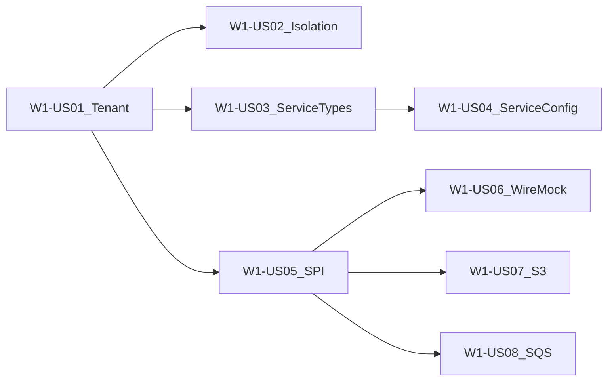

# Wave 1 — Tenancy, Services, Connectors (Execution Plan)

**Branch:** `wave-1`  
**Parent catalog:** [`../../DELIVERY_PLAN.md`](../../DELIVERY_PLAN.md)  
**TDD (stakeholders):** [`../tdd/WAVE_1_TDD.md`](../tdd/WAVE_1_TDD.md)  
**TDD (developers / juniors):** [`../tdd/stories/README.md`](../tdd/stories/README.md) § Wave 1  
**Trackers:** [`../WAVE_TRACKER.md`](../WAVE_TRACKER.md) · [`../TEST_MATRIX.md`](../TEST_MATRIX.md)  
**Story AC template:** [`../STORY_TEMPLATE.md`](../STORY_TEMPLATE.md)  
**Architecture:** [`../../ARCHITECTURE.md`](../../ARCHITECTURE.md) §2, §3.3–3.4, §6.1, §9  
**Tags:** `W1-US01` … `W1-US08` · `wave-1-complete`

---

## Wave goal

Create a tenant, configure Auth-like service config, register Rest/Storage/MessageBus connectors, and pass connection tests against WireMock and LocalStack — with **no cross-tenant reads**.

| Exit criterion | How verified |
|----------------|--------------|
| Tenant CRUD + context | `TenantControllerIT`; stub `X-Tenant-Id` → `TenantContext` |
| Isolation | `TenantIsolationIT` — tenant A cannot read B’s notes/services/connectors |
| Service types + Auth config | Catalog IT; `TenantServiceConfigIT` merge + secret redaction |
| Connector SPI | `ConnectorSpiLoaderTest` — `rest`, `storage`, `message_bus` registered |
| Rest test | `RestConnectorTestIT` vs WireMock `/external/ping` |
| S3 round-trip | `StorageConnectorIT.putGet_roundTrip` vs LocalStack |
| SQS publish (Should) | `MessageBusConnectorIT.publish_succeeds` vs LocalStack |
| Support KB | `docs/delivery/kb/W1-US0*.md` |

---

## Scope

### In scope

| Feature / Epic | Stories |
|----------------|---------|
| **W1-F1** Tenancy / E1 | W1-US01, W1-US02 |
| **W1-F2** Services / E1 | W1-US03, W1-US04 |
| **W1-F3** Connectors / E1–E2 | W1-US05, W1-US06, W1-US07, W1-US08 |

### Out of scope

- Pipeline run orchestration, RabbitMQ stage topology (Wave 2)
- Webhook ingress Jobs / HMAC verify (Wave 3; uses Auth config from US04)
- Billing quotas, UI, real JWT IdP (stub header until later)
- PF4J plugin JARs (Spring `@Component` registry in Wave 1)

---

## Target layout (delivered)

```text
pipeline-api/
  src/main/java/com/pipelineplatform/
    api/tenant/          # CRUD, TenantContext, notes + Hibernate filter
    api/service/         # service types, tenant services, redaction
    api/connector/       # connector types + tenant connectors + /test
    connector/spi/       # Connector SPI (§9)
    connector/rest/      # RestConnector
    connector/storage/   # StorageConnector + LocalStack S3 factory
    connector/messagebus/# MessageBusConnector + SQS factory
    connector/localstack/# shared LocalStack AWS client helpers
  src/main/resources/db/migration/
    V2__tenant_notes.sql … V8__message_bus_connector_type.sql
docs/delivery/
  waves/WAVE_1.md        # this file
  kb/W1-US01-…W1-US08-…
  tdd/stories/w1/W1-US01-…tdd.md
```

---

## Delivery sequence



1. **W1-US01** Tenant CRUD + stub tenant context  
2. **W1-US02** Hibernate tenant isolation (`tenant_notes`)  
3. **W1-US03** Service types + StubAuth defaults  
4. **W1-US04** Tenant service config (merge + redact)  
5. **W1-US05** Connector SPI + Rest plugin  
6. **W1-US06** `POST /connectors/{id}/test` vs WireMock  
7. **W1-US07** Storage connector vs LocalStack S3  
8. **W1-US08** MessageBus connector vs LocalStack SQS (Should)

---

## Story backlog (full AC)

---

### W1-US01 — Tenant CRUD + JWT tenant context

| Field | Value |
|-------|--------|
| **Wave / Feature / Epic** | W1 / W1-F1 / W1-F1-E1 |
| **Priority** | Must |
| **Dependencies** | Wave 0 |
| **Architecture refs** | §2.2 `tenants`, §3, §6.1 |
| **Status** | Done |

**As a** platform operator  
**I want** to create and manage tenants and have every request carry `tenant_id`  
**so that** later APIs can scope data correctly.

**In scope:** `/api/v1/tenants` CRUD; `TenantContext` + stub `X-Tenant-Id` filter (JWT later).  
**Out of scope:** Real IdP / JWT validation.

#### TDD

| Step | Evidence |
|------|----------|
| **Red** | `TenantServiceTest`, `TenantControllerIT` fail |
| **Green** | CRUD + context from header |
| **Refactor** | Shared `TenantContext` accessor |

#### Tests

| Layer | Key |
|-------|-----|
| Unit | Validation; context set/clear |
| IT | CRUD persists; header populates context |

#### Support KB

[`../kb/W1-US01-tenant-crud-context.md`](../kb/W1-US01-tenant-crud-context.md)

#### Developer TDD guide

[`../tdd/stories/w1/W1-US01-tdd.md`](../tdd/stories/w1/W1-US01-tdd.md)

---

### W1-US02 — Tenant isolation filters (JPA)

| Field | Value |
|-------|--------|
| **Wave / Feature / Epic** | W1 / W1-F1 / W1-F1-E1 |
| **Priority** | Must |
| **Dependencies** | W1-US01 |
| **Architecture refs** | §6.1 tenancy |
| **Status** | Done |

**As a** security reviewer  
**I want** Hibernate filters on tenant-owned rows  
**so that** tenant A never reads tenant B’s data.

**In scope:** `@TenantOwned` + `tenantFilter`; proven via `tenant_notes` + `/api/v1/tenant-notes`.  
**Out of scope:** Row-level DB policies beyond Hibernate filter.

#### TDD

| Step | Evidence |
|------|----------|
| **Red** | `TenantIsolationIT` fail |
| **Green** | Cross-tenant GET → 404; own tenant → 200 |
| **Refactor** | Prefer filtered JPQL over `findById` |

#### Support KB

[`../kb/W1-US02-tenant-isolation.md`](../kb/W1-US02-tenant-isolation.md)

#### Developer TDD guide

[`../tdd/stories/w1/W1-US02-tdd.md`](../tdd/stories/w1/W1-US02-tdd.md)

---

### W1-US03 — Service types + platform defaults

| Field | Value |
|-------|--------|
| **Wave / Feature / Epic** | W1 / W1-F2 / W1-F2-E1 |
| **Priority** | Must |
| **Dependencies** | W1-US01 |
| **Architecture refs** | §2 service_types / service_defaults |
| **Status** | Done |

**As a** platform engineer  
**I want** a global catalog of service types with defaults  
**so that** tenants can inherit Auth-like config.

**In scope:** Flyway `V3`; `GET /api/v1/service-types`; seed `st-auth` / `StubAuth`.  
**Out of scope:** Tenant overrides (US04).

#### Support KB

[`../kb/W1-US03-service-types.md`](../kb/W1-US03-service-types.md)

#### Developer TDD guide

[`../tdd/stories/w1/W1-US03-tdd.md`](../tdd/stories/w1/W1-US03-tdd.md)

---

### W1-US04 — Tenant service config (Auth pattern)

| Field | Value |
|-------|--------|
| **Wave / Feature / Epic** | W1 / W1-F2 / W1-F2-E1 |
| **Priority** | Must |
| **Dependencies** | W1-US03 |
| **Architecture refs** | §3.4, §9.3 ServiceResolver |
| **Status** | Done |

**As a** tenant admin  
**I want** to store Auth service config with secret redaction  
**so that** APIs never echo secrets and defaults merge when inherited.

**In scope:** `/api/v1/services` CRUD; `ConfigMerger`; `SecretRedactor`; stub `encrypted:` at rest.  
**Out of scope:** Full OAuth UI; production KMS.

#### Support KB

[`../kb/W1-US04-tenant-service-config.md`](../kb/W1-US04-tenant-service-config.md)

#### Developer TDD guide

[`../tdd/stories/w1/W1-US04-tdd.md`](../tdd/stories/w1/W1-US04-tdd.md)

---

### W1-US05 — Connector SPI load + Rest plugin

| Field | Value |
|-------|--------|
| **Wave / Feature / Epic** | W1 / W1-F3 / W1-F3-E1 |
| **Priority** | Must |
| **Dependencies** | W0-US05 patterns |
| **Architecture refs** | §9.1–9.5 |
| **Status** | Done |

**As a** platform engineer  
**I want** a `Connector` SPI and built-in Rest plugin registered at boot  
**so that** later stories can test and extend connectors.

**In scope:** SPI types; `RestConnector`; `ConnectorRegistry`; `GET /api/v1/connector-types`; Flyway `V5`.  
**Out of scope:** HTTP probe (US06); PF4J JARs.

#### Support KB

[`../kb/W1-US05-connector-spi.md`](../kb/W1-US05-connector-spi.md)

#### Developer TDD guide

[`../tdd/stories/w1/W1-US05-tdd.md`](../tdd/stories/w1/W1-US05-tdd.md)

---

### W1-US06 — Connector test vs WireMock

| Field | Value |
|-------|--------|
| **Wave / Feature / Epic** | W1 / W1-F3 / W1-F3-E1 |
| **Priority** | Must |
| **Dependencies** | W1-US05; W1-US01/02 |
| **Architecture refs** | §3.3 test connection |
| **Status** | Done |

**As a** tenant integrator  
**I want** `POST /api/v1/connectors/{id}/test` to hit WireMock  
**so that** Rest connectivity is proven without the public internet.

**In scope:** `connectors` table (`V6`); tenant CRUD; Rest HTTP GET `{baseUrl}/external/ping`; isolation 404.  
**Out of scope:** Real external IdP.

#### Support KB

[`../kb/W1-US06-connector-test-wiremock.md`](../kb/W1-US06-connector-test-wiremock.md)

#### Developer TDD guide

[`../tdd/stories/w1/W1-US06-tdd.md`](../tdd/stories/w1/W1-US06-tdd.md)

---

### W1-US07 — Storage connector vs LocalStack S3

| Field | Value |
|-------|--------|
| **Wave / Feature / Epic** | W1 / W1-F3 / W1-F3-E2 |
| **Priority** | Must |
| **Dependencies** | W1-US05; W0-US01 |
| **Architecture refs** | §9.5 storage; §10.6 |
| **Status** | Done |

**As a** platform engineer  
**I want** a Storage connector that put/get objects on LocalStack S3  
**so that** cloud storage I/O is proven locally.

**In scope:** `StorageConnector`; AWS SDK v2; path-style; endpoint `http://localhost:4567`; seed `ct-storage`.  
**Out of scope:** Real AWS accounts.

#### Support KB

[`../kb/W1-US07-storage-localstack.md`](../kb/W1-US07-storage-localstack.md)

#### Developer TDD guide

[`../tdd/stories/w1/W1-US07-tdd.md`](../tdd/stories/w1/W1-US07-tdd.md)

---

### W1-US08 — MessageBus connector vs LocalStack SQS (Should)

| Field | Value |
|-------|--------|
| **Wave / Feature / Epic** | W1 / W1-F3 / W1-F3-E2 |
| **Priority** | Should |
| **Dependencies** | W1-US05; W0-US01 |
| **Architecture refs** | §9.5 `message_bus` |
| **Status** | Done |

**As a** platform engineer  
**I want** a MessageBus connector that publishes to LocalStack SQS  
**so that** external queue I/O is proven (distinct from Wave 2 RabbitMQ topology).

**In scope:** `MessageBusConnector`; SQS send/receive; shared LocalStack factory; seed `ct-message-bus`.  
**Out of scope:** Platform inter-stage RabbitMQ (Wave 2).

#### Support KB

[`../kb/W1-US08-messagebus-sqs.md`](../kb/W1-US08-messagebus-sqs.md)

#### Developer TDD guide

[`../tdd/stories/w1/W1-US08-tdd.md`](../tdd/stories/w1/W1-US08-tdd.md)

---

## Implementation checklist

- [x] Tenant CRUD + stub `X-Tenant-Id` context (US01)
- [x] Hibernate `tenantFilter` + isolation IT (US02)
- [x] Service types + StubAuth defaults (US03)
- [x] Tenant services merge/redact (US04)
- [x] Connector SPI + Rest/Storage/MessageBus plugins (US05–US08)
- [x] WireMock Rest test + LocalStack S3/SQS ITs
- [x] Flyway V2–V8
- [x] KB articles W1-US01–US08
- [x] WAVE_TRACKER / TEST_MATRIX updated
- [x] Tags `W1-US0*` + `wave-1-complete`
- [x] PR `wave-1` → `master`

---

## Definition of Done (Wave 1)

- All **Must** stories W1-US01–US07 Done; US08 completed (Should)  
- Exit criteria table at top of this doc verified  
- Each story followed **merge → tag → delete feature branch → next from `wave-1`**  
- PR `wave-1` → `master` opened when exit criteria met  

---

## Risks

| Risk | Mitigation |
|------|------------|
| JWT library choice deferred | Stub `X-Tenant-Id` until IdP wired; document in KB |
| LocalStack flakiness | `assumeTrue` health check; smoke script; path-style + URL rewrite |
| Cross-tenant leak | Isolation IT on notes/services/connectors; fail closed without header |
| Confusing SQS connector with RabbitMQ | KB W1-US08 calls out Wave 2 internal bus |
