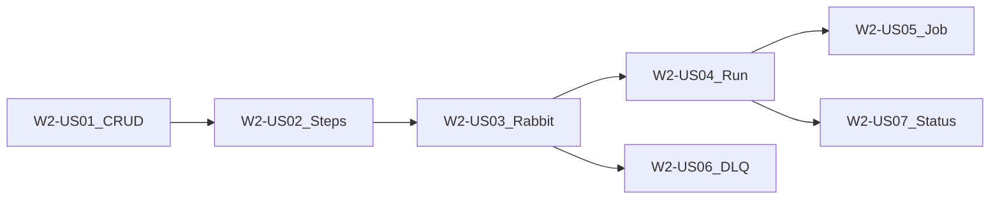

# Wave 2 — Pipelines & Ephemeral Execution (Execution Plan)

**Branch:** `wave-2`  
**Parent catalog:** [`../../DELIVERY_PLAN.md`](../../DELIVERY_PLAN.md)  
**TDD (stakeholders):** [`../tdd/WAVE_2_TDD.md`](../tdd/WAVE_2_TDD.md)  
**TDD (developers / juniors):** [`../tdd/stories/README.md`](../tdd/stories/README.md) § Wave 2  
**Trackers:** [`../WAVE_TRACKER.md`](../WAVE_TRACKER.md) · [`../TEST_MATRIX.md`](../TEST_MATRIX.md)  
**Story AC template:** [`../STORY_TEMPLATE.md`](../STORY_TEMPLATE.md)  
**Architecture:** [`../../ARCHITECTURE.md`](../../ARCHITECTURE.md) §2 pipelines, §3.1–3.2, §5.1 pluggable broker, §8, §10.3  
**Depends on:** Wave 1 complete (`wave-1-complete`)

---

## Wave goal

Configure a Source → Processor → Destination pipeline, run it **async** with **platform message-broker** stage handoff (Wave 2 default: **RabbitMQ**; broker is pluggable — see architecture §5.1), persist execution status, spawn a pipelet Job (Kind or stub), and prove a poison message lands on a stage DLQ.

### Core model (steps → pipelets → pods)

| Concept | Role |
|---------|------|
| **Pipelet** | Reusable unit (image + schema) in the registry — *what can run* |
| **Pipeline step** (`pipeline_steps`) | Per-pipeline binding: which pipelet, order, config, connectors, queues, resource limits — *how it runs in this pipeline* |
| **Job / Pod** (§10.3) | Ephemeral runtime for one step of one execution — *the actual run* |

At `POST .../run`, each step drives a Job named `exec-{execution_id}-stage-{step_order}` in namespace `tenant-{tenant_id}`. Wave 2 may stub the Job client; the step row is still the source of truth for what that pod would run.

### Platform message broker (pluggable)

Stage `input_queue` / `output_queue` are **logical destination names**. Wave 2 implements them on **RabbitMQ**. The same contracts should later adapt to Kafka, SQS, Azure Event Hubs, ActiveMQ, etc. without rewriting pipeline/step APIs.

| Concern | Wave 2 | Later |
|---------|--------|-------|
| Platform inter-stage bus | RabbitMQ (Compose + Spring AMQP) | Message Broker SPI adapters |
| Tenant external bus (`message_bus` connector) | SQS/LocalStack | Other connector plugins |

Do **not** confuse the platform broker with the tenant `message_bus` connector — different purposes.

| Exit criterion | How verified |
|----------------|--------------|
| Pipeline CRUD + steps | `PipelineControllerIT` / steps IT; tenant isolation |
| RabbitMQ topology | `RabbitTopologyIT` — tenant-prefixed exchanges/queues |
| Async 3-stage run → `completed` | Fixture run IT + status API |
| Forced failure → DLQ | `StageDlqIT` |
| Job spawn | Stub or Kind client smoke |
| Support KB | `docs/delivery/kb/W2-*-run-failed.md` (or equivalent) |

---

## Scope

### In scope

| Feature / Epic | Stories |
|----------------|---------|
| **W2-F1** Pipeline API / E1–E2 | W2-US01, W2-US02, W2-US07 |
| **W2-F2** Runtime / E1–E2 | W2-US03, W2-US04, W2-US05 |
| **W2-F3** Resilience / E1 | W2-US06 |

### Out of scope

- Webhook ingress accept path (Wave 3)
- Full Grafana / billing enforcement / UI builder
- Sync execution mode deep dive (Wave 7)
- Production K8s Job client if Kind unavailable (stub OK)

---

## Target layout (planned)

```text
pipeline-api/
  src/main/java/.../pipeline/     # Pipeline, steps, executions, run orchestrator
  src/main/java/.../messaging/    # RabbitMQ topology, naming, DLQ
  src/main/java/.../runtime/      # PipeletJobClient (stub/Kind)
  src/main/resources/db/migration/
    V9__pipelines.sql …           # pipelines, pipeline_steps, pipeline_executions
docs/delivery/
  waves/WAVE_2.md                 # this file
  kb/W2-*.md
  tdd/stories/w2/W2-US01-…tdd.md
```

---

## Delivery sequence



1. **W2-US01** Pipeline CRUD (`visibility`, `execution_mode`)  
2. **W2-US02** Steps config API  
3. **W2-US03** Inter-stage RabbitMQ topology  
4. **W2-US04** Async `POST .../run` orchestration  
5. **W2-US05** Pipelet Job spawn (Kind/stub)  
6. **W2-US06** Retries + per-stage DLQ  
7. **W2-US07** Execution status/detail API  

---

## Story backlog (full AC)

---

### W2-US01 — Pipeline CRUD + visibility/mode

| Field | Value |
|-------|--------|
| **Wave / Feature / Epic** | W2 / W2-F1 / W2-F1-E1 |
| **Priority** | Must |
| **Dependencies** | Wave 1 |
| **Architecture refs** | §2 `pipelines`, §3.1 |
| **Status** | Done |

**As a** tenant admin  
**I want** to create and manage pipelines with visibility and execution mode  
**so that** I can define async/private pipelines before attaching steps.

**In scope:** `/api/v1/pipelines` CRUD (archive on delete); fields `visibility`, `execution_mode`, `status`; tenant filter.  
**Out of scope:** Steps (US02); run (US04).

#### TDD

| Step | Evidence |
|------|----------|
| **Red** | `PipelineServiceTest`, `PipelineControllerIT` fail |
| **Green** | CRUD + tenant scoping |
| **Refactor** | Enum validation |

#### Developer TDD guide

[`../tdd/stories/w2/W2-US01-tdd.md`](../tdd/stories/w2/W2-US01-tdd.md)

#### Support KB (create)

`docs/delivery/kb/W2-US01-pipeline-crud.md`

---

### W2-US02 — Pipeline steps config API

| Field | Value |
|-------|--------|
| **Wave / Feature / Epic** | W2 / W2-F1 / W2-F1-E1 |
| **Priority** | Must |
| **Dependencies** | W2-US01 |
| **Architecture refs** | §2 `pipeline_steps`, §3.1 `PUT .../steps` |
| **Status** | Done |

**As a** tenant admin  
**I want** to replace the step sequence on a pipeline  
**so that** each stage’s pipelet is configured (order, config, connectors, queues, limits) for the Jobs/Pods that will run on `POST .../run`.

**In scope:** `PUT /api/v1/pipelines/{id}/steps`; `step_order`, `pipelet_id`, `config`, `connector_ids`, queue name fields (may be placeholders until US03).  
**Out of scope:** Declaring RabbitMQ (US03); requiring real pipelet registry rows if stubbed; spawning Jobs (US05).

**Model reminder:** step = pipelet config for this pipeline; Job/Pod = that step running for an execution (see wave goal § Core model).

#### Developer TDD guide

[`../tdd/stories/w2/W2-US02-tdd.md`](../tdd/stories/w2/W2-US02-tdd.md)

#### Support KB (create)

`docs/delivery/kb/W2-US02-pipeline-steps.md`

---

### W2-US03 — Inter-stage RabbitMQ topology

| Field | Value |
|-------|--------|
| **Wave / Feature / Epic** | W2 / W2-F2 / W2-F2-E1 |
| **Priority** | Must |
| **Dependencies** | W2-US02 |
| **Architecture refs** | §8 messaging; tenant-prefixed names |
| **Status** | Done |

**As a** platform engineer  
**I want** tenant-prefixed stage destinations declared on the platform message broker  
**so that** stages can publish/consume without colliding across tenants.

**In scope:** Naming builder; declare topology; publish/consume IT against Compose/Testcontainers **RabbitMQ** (Wave 2 default broker).  
**Out of scope:** Full orchestration (US04); webhook queues (W3); Kafka/SQS/Event Hubs/ActiveMQ adapters (architecture §5.1 — later waves).

#### Developer TDD guide

[`../tdd/stories/w2/W2-US03-tdd.md`](../tdd/stories/w2/W2-US03-tdd.md)

#### Support KB (create)

`docs/delivery/kb/W2-US03-rabbit-topology.md`

---

### W2-US04 — Async run orchestration

| Field | Value |
|-------|--------|
| **Wave / Feature / Epic** | W2 / W2-F2 / W2-F2-E2 |
| **Priority** | Must |
| **Dependencies** | W2-US03 |
| **Architecture refs** | §3.1 `POST .../run`, §8 async |
| **Status** | Done |

**As a** tenant operator  
**I want** `POST /api/v1/pipelines/{id}/run` to start an async execution  
**so that** stages advance via RabbitMQ without blocking the HTTP call.

**In scope:** Create `pipeline_executions` row; kick off stage handoff; return execution id quickly.  
**Out of scope:** Real container Jobs (US05 can stub); sync mode.

#### Developer TDD guide

[`../tdd/stories/w2/W2-US04-tdd.md`](../tdd/stories/w2/W2-US04-tdd.md)

#### Support KB (create)

`docs/delivery/kb/W2-US04-async-run.md`

---

### W2-US05 — Pipelet Job spawn (Kind/stub)

| Field | Value |
|-------|--------|
| **Wave / Feature / Epic** | W2 / W2-F2 / W2-F2-E2 |
| **Priority** | Must |
| **Dependencies** | W2-US04 |
| **Architecture refs** | §10.3 Jobs |
| **Status** | Done |

**As a** platform engineer  
**I want** a `PipeletJobClient` that creates a Job (Kind or stub)  
**so that** orchestration can request ephemeral work without hard-coding K8s.

**In scope:** Interface + stub implementation; optional Kind smoke.  
**Out of scope:** Production cluster RBAC.

#### Developer TDD guide

[`../tdd/stories/w2/W2-US05-tdd.md`](../tdd/stories/w2/W2-US05-tdd.md)

#### Support KB (create)

`docs/delivery/kb/W2-US05-pipelet-job.md`

---

### W2-US06 — Retries + per-stage DLQ

| Field | Value |
|-------|--------|
| **Wave / Feature / Epic** | W2 / W2-F3 / W2-F3-E1 |
| **Priority** | Must |
| **Dependencies** | W2-US03 |
| **Architecture refs** | §8 retries / DLQ |
| **Status** | Done |

**As a** platform engineer  
**I want** poison messages to retry then land on a stage DLQ  
**so that** failures are observable and do not block the main queue.

**In scope:** Retry policy from `retry_config`; DLQ bind; IT with forced failure.  
**Out of scope:** Full alerting UI.

#### Developer TDD guide

[`../tdd/stories/w2/W2-US06-tdd.md`](../tdd/stories/w2/W2-US06-tdd.md)

#### Support KB (create)

`docs/delivery/kb/W2-US06-stage-dlq.md` (feeds “pipeline run failed” article)

---

### W2-US07 — Execution status query API

| Field | Value |
|-------|--------|
| **Wave / Feature / Epic** | W2 / W2-F1 / W2-F1-E2 |
| **Priority** | Must |
| **Dependencies** | W2-US04 |
| **Architecture refs** | §3.1 executions endpoints |
| **Status** | Todo |

**As a** tenant operator  
**I want** to list and get execution detail  
**so that** I can see stage status for a fixture run.

**In scope:** `GET .../executions`, `GET .../executions/{execId}`; tenant isolation.  
**Out of scope:** Full per-stage metrics dashboards (Wave 4).

#### Developer TDD guide

[`../tdd/stories/w2/W2-US07-tdd.md`](../tdd/stories/w2/W2-US07-tdd.md)

#### Support KB (create)

`docs/delivery/kb/W2-US07-execution-status.md`

---

## Implementation checklist (start of wave)

- [x] `wave-2` branched from `master` (post Wave 1 merge)
- [x] This execution plan + junior TDD guides committed
- [x] `W2-US01` feature branch created
- [x] W2-US01 Pipeline CRUD implemented (`V9__pipelines.sql`)
- [x] W2-US02 Pipeline steps implemented (`V10__pipeline_steps.sql`)
- [x] W2-US03 RabbitMQ topology (`QueueNaming` + `PipelineTopologyService`)
- [x] W2-US04 Async run (`V11__pipeline_executions.sql` + stub stage worker)
- [x] W2-US05 PipeletJobClient stub wired into run path
- [x] W2-US06 Retries + per-stage DLQ (`RetryPolicy` + DLX binds)
- [ ] WAVE_TRACKER / TEST_MATRIX / WAVE_2_TDD updated as stories complete
- [ ] Each story: merge → tag `W2-US##` → delete → next from `wave-2`

---

## Definition of Done (Wave 2)

- All **Must** stories W2-US01–US07 Done  
- Exit criteria table verified (3-stage `completed` + DLQ path)  
- KB for pipeline run failure / dataflow published  
- PR `wave-2` → `master` when exit criteria met  

---

## Risks

| Risk | Mitigation |
|------|------------|
| Kind unavailable | Stub `PipeletJobClient` with contract tests |
| Async IT flakes | Awaitility + bounded timeouts |
| Topology drift vs W3 | Shared routing-key / queue naming builder |
| Scope creep into webhooks | Reject ingress controllers on `wave-2` |
