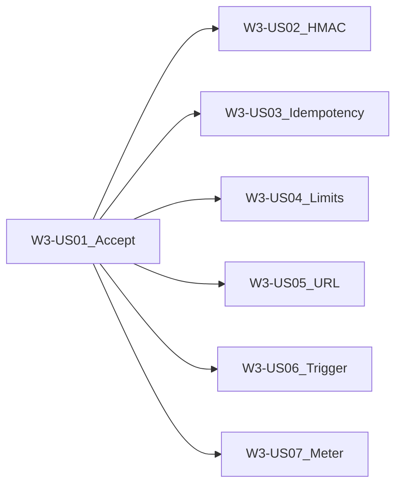

# Wave 3 — Webhook Ingress + Queue (Execution Plan)

**Branch:** `wave-3`  
**Parent catalog:** [`../../DELIVERY_PLAN.md`](../../DELIVERY_PLAN.md)  
**TDD (stakeholders):** [`../tdd/WAVE_3_TDD.md`](../tdd/WAVE_3_TDD.md)  
**TDD (developers / juniors):** [`../tdd/stories/README.md`](../tdd/stories/README.md) § Wave 3  
**Trackers:** [`../WAVE_TRACKER.md`](../WAVE_TRACKER.md) · [`../TEST_MATRIX.md`](../TEST_MATRIX.md)  
**Story AC template:** [`../STORY_TEMPLATE.md`](../STORY_TEMPLATE.md)  
**Architecture:** [`../../ARCHITECTURE.md`](../../ARCHITECTURE.md) **§11**, §3.3 webhook APIs, §5.1 broker  
**Depends on:** Wave 2 complete (`wave-2-complete`)

---

## Wave goal

Always-on **webhook ingress** returns `202` immediately, publishes to a tenant webhook queue on the platform message broker (Wave 3 default: **RabbitMQ**), then later stories add signature/idempotency/limits, URL provisioning, on-demand processor trigger, and metering — **without** cold-starting a pipelet pod at accept time.

### Core model (ingress ≠ processing)

| Concept | Role |
|---------|------|
| **Webhook Ingress** | Always-on HTTP endpoint; validate tenant+connector; publish; `202` |
| **Webhook queue** | `tenant.{tenantId}.webhook.{connectorId}.in` (+ `.dlq`) |
| **Processor Job** | On-demand (W3-US06) when queue depth > 0 — not started by US01 accept |

Do **not** confuse webhook queues with Wave 2 **stage** topology (`…stage.{n}.in`).

| Exit criterion | How verified |
|----------------|--------------|
| External POST → `202` + `event_id` | `WebhookControllerIT` + curl |
| Message on webhook `.in` | Rabbit assert / mgmt |
| No Job on accept alone | Unit/IT assert Job client not called (US01) |
| Support KB | `kb/W3-US01-webhook-ingress-accept.md` (+ suite) |

---

## Scope

### In scope

| Feature / Epic | Stories |
|----------------|---------|
| **W3-F1** Ingress core | W3-US01, W3-US02, W3-US03, W3-US04 (Should) |
| **W3-F2** Binding & trigger | W3-US05, W3-US06 |
| **W3-F3** Metering hooks | W3-US07 |

### Out of scope

- Full UI provisioning UX (Wave 6)
- Completeness dashboards (Wave 4)
- PAYG hard blocks (Wave 5)
- Replacing Wave 2 stage topology

---

## Target layout (planned)

```text
pipeline-api/
  src/main/java/.../webhook/      # Ingress controller/service, signature, idempotency
  src/main/java/.../messaging/    # Extend QueueNaming + webhook topology declare
docs/delivery/
  waves/WAVE_3.md                 # this file
  kb/W3-*.md
  tdd/stories/w3/W3-US01-…tdd.md
```

---

## Delivery sequence



1. **W3-US01** Ingress accept + queue publish  
2. **W3-US02** HMAC/signature + Auth service  
3. **W3-US03** Idempotency  
4. **W3-US04** Rate limit / backpressure (Should)  
5. **W3-US05** Provision webhook URL  
6. **W3-US06** On-demand processor trigger  
7. **W3-US07** Meter webhook_events + bytes_in  

---

## Story backlog (full AC)

---

### W3-US01 — Ingress accept + queue publish

| Field | Value |
|-------|--------|
| **Wave / Feature / Epic** | W3 / W3-F1 / W3-F1-E1 |
| **Priority** | Must |
| **Dependencies** | W2-US03; W1 tenant/connectors |
| **Architecture refs** | §11.2–11.5, §3.3 |
| **Status** | Done |

**As a** tenant integrator  
**I want** to POST events to a stable platform webhook URL  
**so that** events are durably queued without a hot pipelet at ingress time.

**In scope:** `POST /api/v1/webhooks/{tenantId}/{connectorId}`; validate tenant+connector; publish to `tenant.{T}.webhook.{C}.in`; `202` + `event_id` (+ `queued_to`); never start K8s Job on accept.  
**Out of scope:** Signature (US02); idempotency (US03); Job trigger (US06).

#### Developer TDD guide

[`../tdd/stories/w3/W3-US01-tdd.md`](../tdd/stories/w3/W3-US01-tdd.md)

#### Support KB

[`../kb/W3-US01-webhook-ingress-accept.md`](../kb/W3-US01-webhook-ingress-accept.md)

---

### W3-US02 — Signature verification + Auth service

| Field | Value |
|-------|--------|
| **Wave / Feature / Epic** | W3 / W3-F1 / W3-F1-E1 |
| **Priority** | Must |
| **Dependencies** | W3-US01; W1-US04 |
| **Architecture refs** | §11 security; §9.3 ServiceResolver |
| **Status** | Done |

**In scope:** HMAC (or vendor) verify using tenant Auth service config; reject invalid signatures.  
**Out of scope:** Full OAuth login UI.

#### Developer TDD guide

[`../tdd/stories/w3/W3-US02-tdd.md`](../tdd/stories/w3/W3-US02-tdd.md)

#### Support KB

[`../kb/W3-US02-webhook-signature.md`](../kb/W3-US02-webhook-signature.md)

---

### W3-US03 — Idempotency (X-Webhook-Id / hash)

| Field | Value |
|-------|--------|
| **Wave / Feature / Epic** | W3 / W3-F1 / W3-F1-E2 |
| **Priority** | Must |
| **Dependencies** | W3-US01 |
| **Architecture refs** | §11 idempotency |
| **Status** | Done |

**In scope:** Deduplicate via `X-Webhook-Id` or payload hash; duplicate POST → same logical outcome.  
**Out of scope:** Cross-region shared store (document TTL strategy).

#### Developer TDD guide

[`../tdd/stories/w3/W3-US03-tdd.md`](../tdd/stories/w3/W3-US03-tdd.md)

#### Support KB

[`../kb/W3-US03-webhook-idempotency.md`](../kb/W3-US03-webhook-idempotency.md)

---

### W3-US04 — Rate limit + backpressure (Should)

| Field | Value |
|-------|--------|
| **Wave / Feature / Epic** | W3 / W3-F1 / W3-F1-E2 |
| **Priority** | Should |
| **Dependencies** | W3-US01 |
| **Architecture refs** | §11 limits |
| **Status** | Todo |

**In scope:** `429` when rate exceeded; `503` when broker publish fails (sender retries).  
**Out of scope:** Global multi-node rate store (document local/simple approach OK for Wave 3).

#### Developer TDD guide

[`../tdd/stories/w3/W3-US04-tdd.md`](../tdd/stories/w3/W3-US04-tdd.md)

#### Support KB (create)

`docs/delivery/kb/W3-US04-webhook-rate-limit.md`

---

### W3-US05 — Provision webhook URL API

| Field | Value |
|-------|--------|
| **Wave / Feature / Epic** | W3 / W3-F2 / W3-F2-E1 |
| **Priority** | Must |
| **Dependencies** | W3-US01 |
| **Architecture refs** | §3.3 `POST /connectors/{id}/webhook-url` |
| **Status** | Todo |

**In scope:** Provision stable ingress URL for `event_listener` connectors; tenant isolation.  
**Out of scope:** Custom domains / TLS cert automation.

#### Developer TDD guide

[`../tdd/stories/w3/W3-US05-tdd.md`](../tdd/stories/w3/W3-US05-tdd.md)

#### Support KB (create)

`docs/delivery/kb/W3-US05-webhook-url-provision.md`

---

### W3-US06 — On-demand processor trigger

| Field | Value |
|-------|--------|
| **Wave / Feature / Epic** | W3 / W3-F2 / W3-F2-E1 |
| **Priority** | Must |
| **Dependencies** | W3-US01; W2-US04/US05 |
| **Architecture refs** | §11 on-demand processing; §10.3 |
| **Status** | Todo |

**In scope:** When webhook queue depth > 0, trigger processor Job (stub `PipeletJobClient` OK).  
**Out of scope:** Full autoscaler / HPA.

#### Developer TDD guide

[`../tdd/stories/w3/W3-US06-tdd.md`](../tdd/stories/w3/W3-US06-tdd.md)

#### Support KB (create)

`docs/delivery/kb/W3-US06-webhook-queue-trigger.md`

---

### W3-US07 — Meter webhook_events + bytes_in

| Field | Value |
|-------|--------|
| **Wave / Feature / Epic** | W3 / W3-F3 / W3-F3-E1 |
| **Priority** | Must |
| **Dependencies** | W3-US01 |
| **Architecture refs** | §11 metering; §6 PAYG dimensions |
| **Status** | Todo |

**In scope:** Emit `platform.webhook_events` and `data.bytes_in` on accept.  
**Out of scope:** Billing enforcement (Wave 5).

#### Developer TDD guide

[`../tdd/stories/w3/W3-US07-tdd.md`](../tdd/stories/w3/W3-US07-tdd.md)

#### Support KB (create)

`docs/delivery/kb/W3-US07-webhook-metering.md`

---

## Implementation checklist (start of wave)

- [x] `wave-3` branched from `master` (post Wave 2 merge / `wave-2-complete`)
- [x] This execution plan + junior TDD guides committed
- [x] `W3-US01` feature branch created
- [x] W3-US01 Ingress accept + publish implemented (`V12__event_listener_connector_type.sql`)
- [x] W3-US02 HMAC signature verification
- [x] W3-US03 Idempotency (`V13__webhook_idempotency.sql`)
- [ ] WAVE_TRACKER / TEST_MATRIX / WAVE_3_TDD updated as stories complete
- [ ] Each story: merge → tag `W3-US##` → delete → next from `wave-3`

---

## Definition of Done (Wave 3)

- All **Must** stories W3-US01–US03, US05–US07 Done; US04 Should completed or deferred with tracker note  
- Exit criteria verified (202 + queue message + KB)  
- PR `wave-3` → `master` when exit criteria met  
- Tag `wave-3-complete`

---

## Risks

| Risk | Mitigation |
|------|------------|
| Clock skew HMAC | Skew window in US02 tests |
| Broker down | Document 503 + IT (US04) |
| Job trigger coupling | Reuse W2 stub `PipeletJobClient` |
| Confusing webhook vs stage queues | Shared naming builder + KB callouts |
