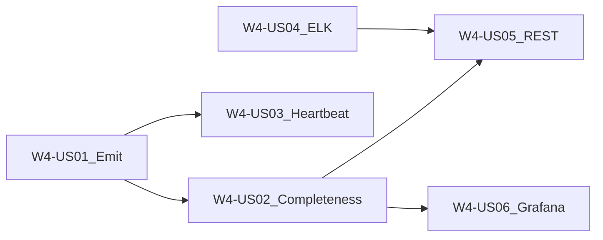

# Wave 4 — Observability (Execution Plan)

**Branch:** `wave-4`  
**Parent catalog:** [`../../DELIVERY_PLAN.md`](../../DELIVERY_PLAN.md)  
**TDD (stakeholders):** [`../tdd/WAVE_4_TDD.md`](../tdd/WAVE_4_TDD.md)  
**TDD (developers / juniors):** [`../tdd/stories/README.md`](../tdd/stories/README.md) § Wave 4  
**Trackers:** [`../WAVE_TRACKER.md`](../WAVE_TRACKER.md) · [`../TEST_MATRIX.md`](../TEST_MATRIX.md)  
**Story AC template:** [`../STORY_TEMPLATE.md`](../STORY_TEMPLATE.md)  
**Architecture:** [`../../ARCHITECTURE.md`](../../ARCHITECTURE.md) **§7**, §3.6  
**Depends on:** Wave 2 fixture executions; W0-US04 Prometheus baseline; Wave 3 complete (`wave-3-complete`)

---

## Wave goal

Operators and support can see **completeness %**, latency, heartbeats, critical errors, and logs for a known fixture execution — via Micrometer/Prometheus, an ELK path, observability REST APIs, and optional Grafana tenant orgs.

| Exit criterion | How verified |
|----------------|--------------|
| Completeness for fixture `execution_id` | US02 calc + US05 REST |
| Pipelet counters / histograms | US01 Prometheus / unit |
| Heartbeat + critical errors | US03 gauges/counters |
| Logs for `exec-*` | US04 ELK smoke / index pattern |
| Support KB | `kb/W4-*-completeness.md` (+ suite) |

---

## Scope

### In scope

| Feature / Epic | Stories |
|----------------|---------|
| **W4-F1** Metrics | W4-US01, W4-US02, W4-US03 |
| **W4-F2** Logs & APIs | W4-US04, W4-US05, W4-US06 (Should) |

### Out of scope

- UI observability panels (W6-US06)
- PAYG usage totals / quotas (Wave 5)
- Replacing W0 Prometheus scrape baseline (extend it)

---

## Target layout (planned)

```text
pipeline-api/
  src/main/java/.../observability/   # emitters, completeness, REST
  src/main/java/.../metrics/         # Micrometer binders (or under observability)
docs/delivery/
  waves/WAVE_4.md
  kb/W4-*.md
  tdd/stories/w4/W4-US01-…tdd.md
```

---

## Delivery sequence



1. **W4-US01** Emit pipelet counters + histograms  
2. **W4-US02** Completeness ratio on fixture run  
3. **W4-US03** Heartbeat + critical error metrics  
4. **W4-US04** Logs → Logstash → ES → Kibana pattern  
5. **W4-US05** Observability REST APIs  
6. **W4-US06** Grafana dashboards (Should)  

---

## Story backlog (full AC)

---

### W4-US01 — Emit pipelet counters + histograms

| Field | Value |
|-------|--------|
| **Wave / Feature / Epic** | W4 / W4-F1 / W4-F1-E1 |
| **Priority** | Must |
| **Dependencies** | W2 fixture run; W0-US04 Prometheus |
| **Architecture refs** | §7.1 `pipelet_records_*`, `pipelet_processing_duration_seconds` |
| **Status** | Done |

**In scope:** Emit `pipelet_records_in_total`, `pipelet_records_out_total`, processing histogram with tenant/pipeline/pipelet labels.  
**Out of scope:** Completeness gauge (US02); heartbeat (US03).

#### Developer TDD guide

[`../tdd/stories/w4/W4-US01-tdd.md`](../tdd/stories/w4/W4-US01-tdd.md)

#### Support KB

[`../kb/W4-US01-pipelet-metrics.md`](../kb/W4-US01-pipelet-metrics.md)

---

### W4-US02 — Completeness ratio on fixture run

| Field | Value |
|-------|--------|
| **Wave / Feature / Epic** | W4 / W4-F1 / W4-F1-E1 |
| **Priority** | Must |
| **Dependencies** | W4-US01 |
| **Architecture refs** | §7.4 Completeness |
| **Status** | Done |

**In scope:** Compute `(records_out / records_in) * 100` for fixture execution; expose `pipeline_completeness_ratio` (or equivalent).  
**Out of scope:** Grafana alert wiring (US06).

#### Developer TDD guide

[`../tdd/stories/w4/W4-US02-tdd.md`](../tdd/stories/w4/W4-US02-tdd.md)

#### Support KB

[`../kb/W4-US02-completeness.md`](../kb/W4-US02-completeness.md)

---

### W4-US03 — Heartbeat + critical error metrics

| Field | Value |
|-------|--------|
| **Wave / Feature / Epic** | W4 / W4-F1 / W4-F1-E2 |
| **Priority** | Must |
| **Dependencies** | W4-US01 |
| **Architecture refs** | §7.1, §7.5 |
| **Status** | Done |

**In scope:** `pipelet_heartbeat_timestamp` gauge; `pipelet_errors_total` (critical) counter; document label cardinality.  
**Out of scope:** Real K8s pod heartbeats (stub/timer OK).

#### Developer TDD guide

[`../tdd/stories/w4/W4-US03-tdd.md`](../tdd/stories/w4/W4-US03-tdd.md)

#### Support KB

[`../kb/W4-US03-heartbeat-errors.md`](../kb/W4-US03-heartbeat-errors.md)

---

### W4-US04 — Logs → Logstash → ES → Kibana

| Field | Value |
|-------|--------|
| **Wave / Feature / Epic** | W4 / W4-F2 / W4-F2-E1 |
| **Priority** | Must |
| **Dependencies** | W0 structured logs |
| **Architecture refs** | §7.3 Logging (ELK) |
| **Status** | Done |

**In scope:** Index naming `pipeline-logs-{tenant}-{date}`; smoke that a fixture log is queryable (Compose ELK or documented stub).  
**Out of scope:** Full Filebeat sidecar in Kind (document path).

#### Developer TDD guide

[`../tdd/stories/w4/W4-US04-tdd.md`](../tdd/stories/w4/W4-US04-tdd.md)

#### Support KB

[`../kb/W4-US04-elk-logs.md`](../kb/W4-US04-elk-logs.md)

---

### W4-US05 — Observability REST APIs

| Field | Value |
|-------|--------|
| **Wave / Feature / Epic** | W4 / W4-F2 / W4-F2-E2 |
| **Priority** | Must |
| **Dependencies** | W4-US02; W4-US04 preferred |
| **Architecture refs** | §3.6 Observability Endpoints |
| **Status** | Todo |

**In scope:** Tenant-scoped REST for completeness, latency, heartbeat, errors, execution logs.  
**Out of scope:** UI panels (Wave 6).

#### Developer TDD guide

[`../tdd/stories/w4/W4-US05-tdd.md`](../tdd/stories/w4/W4-US05-tdd.md)

#### Support KB (create)

`docs/delivery/kb/W4-US05-observability-api.md`

---

### W4-US06 — Grafana dashboards (Should)

| Field | Value |
|-------|--------|
| **Wave / Feature / Epic** | W4 / W4-F2 / W4-F2-E1 |
| **Priority** | Should |
| **Dependencies** | W4-US02 |
| **Architecture refs** | §7.2 Grafana |
| **Status** | Todo |

**In scope:** Provision tenant Grafana org/dashboard via API (stub OK).  
**Out of scope:** Full multi-cluster Grafana ops.

#### Developer TDD guide

[`../tdd/stories/w4/W4-US06-tdd.md`](../tdd/stories/w4/W4-US06-tdd.md)

#### Support KB (create)

`docs/delivery/kb/W4-US06-grafana-provision.md`

---

## Implementation checklist (start of wave)

- [x] `wave-4` branched from `master` (post Wave 3 merge / `wave-3-complete`)
- [x] This execution plan + junior TDD guides committed
- [x] `W4-US01` feature branch created
- [x] W4-US01 Pipelet metrics emit (`PipeletMetricsEmitter` + stub worker)
- [x] W4-US02 Completeness calculator + gauge + `completeness_pct` on execution
- [x] W4-US03 Heartbeat gauge + critical error counter (`PipeletErrorType`)
- [x] W4-US04 ELK path (stub indexer + optional compose `--profile elk`)
- [ ] WAVE_TRACKER / TEST_MATRIX / WAVE_4_TDD updated as stories complete
- [ ] Each story: merge → tag `W4-US##` → delete → next from `wave-4`

---

## Definition of Done (Wave 4)

- All **Must** stories W4-US01–US05 Done; US06 Should completed or deferred with tracker note  
- Exit criteria verified (completeness + logs for fixture)  
- PR `wave-4` → `master` when exit criteria met  
- Tag `wave-4-complete`

---

## Risks

| Risk | Mitigation |
|------|------------|
| High-cardinality labels | Prefer low-cardinality series; document `execution_id` policy |
| Full ELK heavy in CI | Labeled smoke; unit JSON shape always |
| Grafana optional | Should; defer with tracker note |
