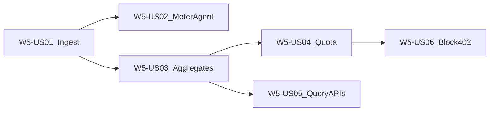

# Wave 5 — Metering & Pay-as-you-go (Execution Plan)

**Branch:** `wave-5`  
**Parent catalog:** [`../../DELIVERY_PLAN.md`](../../DELIVERY_PLAN.md)  
**TDD (stakeholders):** [`../tdd/WAVE_5_TDD.md`](../tdd/WAVE_5_TDD.md)  
**TDD (developers / juniors):** [`../tdd/stories/README.md`](../tdd/stories/README.md) § Wave 5  
**Trackers:** [`../WAVE_TRACKER.md`](../WAVE_TRACKER.md) · [`../TEST_MATRIX.md`](../TEST_MATRIX.md)  
**Story AC template:** [`../STORY_TEMPLATE.md`](../STORY_TEMPLATE.md)  
**Architecture:** [`../../ARCHITECTURE.md`](../../ARCHITECTURE.md) **§6.2**, §3.5  
**Depends on:** Wave 2 fixture runs; Wave 3 webhook meters (`UsageEventEmitter`); Wave 4 complete (`wave-4-complete`); W0 MySQL

---

## Wave goal

A fixture pipeline run (plus webhook path) yields **billable usage** across compute, records, connector calls, and webhooks; events persist; hourly aggregates roll up; soft/hard quotas and credits enforce; hard limit or zero credit returns **`402`** on run.

| Exit criterion | How verified |
|----------------|--------------|
| UsageEvent persist | US01 IT insert/query |
| MeterAgent emit from run | US02 unit + IT |
| Hourly aggregates | US03 job IT (fixed clock) |
| Soft/hard quota + credits | US04 unit + API |
| Usage/billing query APIs | US05 IT ± tolerance |
| Hard block `402` | US06 run IT |
| Billing-dispute KB | `kb/W5-*-billing-dispute.md` |

---

## Scope

### In scope

| Feature / Epic | Stories |
|----------------|---------|
| **W5-F1** Usage pipeline | W5-US01, W5-US02, W5-US03 |
| **W5-F2** Billing controls | W5-US04, W5-US05, W5-US06 |

### Out of scope

- Payment provider / invoice PDF generation
- UI billing pages (Wave 6)
- Replacing W3 stub collector for webhooks (extend to MySQL persist)

---

## Target layout (planned)

```text
pipeline-api/
  src/main/java/.../usage/       # UsageEvent persist, MeterAgent, aggregates
  src/main/java/.../billing/     # QuotaEvaluator, credit, query APIs
  db/migration/V##__usage_*.sql
docs/delivery/
  waves/WAVE_5.md
  kb/W5-*.md
  tdd/stories/w5/W5-US01-…tdd.md
```

**Existing seams (reuse):** `UsageEvent`, `UsageEventCollector`, `UsageEventEmitter`, `StubUsageEventCollector` (W3-US07).

---

## Delivery sequence



1. **W5-US01** UsageEvent ingest + MySQL persist  
2. **W5-US02** MeterAgent emit from pipelet / stub run  
3. **W5-US03** Hourly aggregate job  
4. **W5-US04** Soft/hard quota + credit balance  
5. **W5-US05** Usage / billing / quota query APIs  
6. **W5-US06** Block run on hard limit / zero credit (`402`)  

---

## Story backlog (full AC)

---

### W5-US01 — UsageEvent ingest + persist

| Field | Value |
|-------|--------|
| **Wave / Feature / Epic** | W5 / W5-F1 / W5-F1-E1 |
| **Priority** | Must |
| **Dependencies** | W0 MySQL; W3 `UsageEvent` shape |
| **Architecture refs** | §6.2 `usage_events` |
| **Status** | Done |

**In scope:** Persist usage events to MySQL (`usage_events`); replace or wrap stub collector with durable sink; idempotent ingest keys.  
**Out of scope:** Aggregates (US03); MeterAgent pipelet emit (US02).

#### Developer TDD guide

[`../tdd/stories/w5/W5-US01-tdd.md`](../tdd/stories/w5/W5-US01-tdd.md)

#### Support KB

[`../kb/W5-US01-usage-ingest.md`](../kb/W5-US01-usage-ingest.md)

---

### W5-US02 — MeterAgent emit from pipelet run

| Field | Value |
|-------|--------|
| **Wave / Feature / Epic** | W5 / W5-F1 / W5-F1-E1 |
| **Priority** | Must |
| **Dependencies** | W5-US01; W2 stub stage / fixture run |
| **Architecture refs** | §6.2 dimensions |
| **Status** | Done |

**In scope:** Emit usage from fixture pipelet/stub path (records, compute stub, connector calls as applicable); align with W3 webhook dimensions.  
**Out of scope:** Real K8s metrics-server billing accuracy.

#### Developer TDD guide

[`../tdd/stories/w5/W5-US02-tdd.md`](../tdd/stories/w5/W5-US02-tdd.md)

#### Support KB

[`../kb/W5-US02-meter-agent.md`](../kb/W5-US02-meter-agent.md)

---

### W5-US03 — Hourly aggregates job

| Field | Value |
|-------|--------|
| **Wave / Feature / Epic** | W5 / W5-F1 / W5-F1-E2 |
| **Priority** | Must |
| **Dependencies** | W5-US01 |
| **Architecture refs** | §6.2 `usage_aggregates`, aggregation schedule |
| **Status** | Done |

**In scope:** Hourly rollup job into `usage_aggregates`; idempotent re-run for same hour; fixed-clock tests.  
**Out of scope:** Monthly invoice generation.

#### Developer TDD guide

[`../tdd/stories/w5/W5-US03-tdd.md`](../tdd/stories/w5/W5-US03-tdd.md)

#### Support KB

[`../kb/W5-US03-hourly-aggregates.md`](../kb/W5-US03-hourly-aggregates.md)

---

### W5-US04 — Soft/hard quota + credit balance

| Field | Value |
|-------|--------|
| **Wave / Feature / Epic** | W5 / W5-F2 / W5-F2-E1 |
| **Priority** | Must |
| **Dependencies** | W5-US03 |
| **Architecture refs** | §6.2 Quota Enforcement; `tenants.credit_balance` / `quota_config` |
| **Status** | Done |

**In scope:** Evaluate soft warn vs hard block; read/update credit balance on aggregate path (stub deduct OK).  
**Out of scope:** Notification service delivery (log/stub warn OK).

#### Developer TDD guide

[`../tdd/stories/w5/W5-US04-tdd.md`](../tdd/stories/w5/W5-US04-tdd.md)

#### Support KB

[`../kb/W5-US04-quota-credits.md`](../kb/W5-US04-quota-credits.md)

---

### W5-US05 — Usage and billing query APIs

| Field | Value |
|-------|--------|
| **Wave / Feature / Epic** | W5 / W5-F2 / W5-F2-E1 |
| **Priority** | Must |
| **Dependencies** | W5-US03 |
| **Architecture refs** | §3.5 Usage and Billing Endpoints |
| **Status** | Done |

**In scope:** Tenant-scoped `GET .../usage`, events, quota (and billing periods stub if needed); summary within documented tolerance of fixture.  
**Out of scope:** Invoice PDF / payment links.

#### Developer TDD guide

[`../tdd/stories/w5/W5-US05-tdd.md`](../tdd/stories/w5/W5-US05-tdd.md)

#### Support KB

[`../kb/W5-US05-usage-billing-api.md`](../kb/W5-US05-usage-billing-api.md)

---

### W5-US06 — Block run on hard limit / zero credit (`402`)

| Field | Value |
|-------|--------|
| **Wave / Feature / Epic** | W5 / W5-F2 / W5-F2-E2 |
| **Priority** | Must |
| **Dependencies** | W5-US04; W2 run API |
| **Architecture refs** | §6.2 Quota Enforcement |
| **Status** | Todo |

**In scope:** Pre-run quota/credit check in orchestrator/run path; HTTP **402** with quota details when hard-limited or credit ≤ 0.  
**Out of scope:** Soft-limit UX beyond warn stub.

#### Developer TDD guide

[`../tdd/stories/w5/W5-US06-tdd.md`](../tdd/stories/w5/W5-US06-tdd.md)

#### Support KB (create)

`docs/delivery/kb/W5-US06-run-blocked-402.md` (or fold into billing-dispute KB)

---

## Implementation checklist (start of wave)

- [x] `wave-5` branched from `master` (post Wave 4 merge / `wave-4-complete`)
- [x] This execution plan + junior TDD guides committed
- [x] `W5-US01` feature branch created
- [x] W5-US01 UsageEvent ingest + persist (`PersistingUsageEventCollector` + V14)
- [x] W5-US02 MeterAgent emit from stub stage worker
- [ ] WAVE_TRACKER / TEST_MATRIX / WAVE_5_TDD updated as stories complete
- [ ] Each story: merge → tag `W5-US##` → delete → next from `wave-5`

---

## Definition of Done (Wave 5)

- All **Must** stories W5-US01–US06 Done  
- Exit criteria verified (usage summary ± tolerance; `402` on hard/zero credit)  
- Billing-dispute KB drafted  
- PR `wave-5` → `master` when exit criteria met  
- Tag `wave-5-complete`

---

## Risks

| Risk | Mitigation |
|------|------------|
| Double-count meters | Idempotent event ids; IT |
| Clock skew aggregates | UTC + fixed Instant tests |
| Orchestrator coupling for 402 | Thin quota gate before W2 start |
| W3 stub vs durable collector | US01 wraps collector; keep webhook path green |
