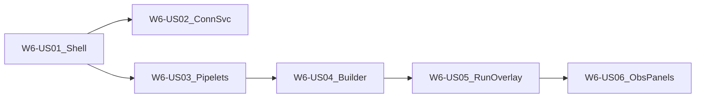

# Wave 6 — No-code UI (Execution Plan)

**Branch:** `wave-6`  
**Parent catalog:** [`../../DELIVERY_PLAN.md`](../../DELIVERY_PLAN.md)  
**TDD (stakeholders):** [`../tdd/WAVE_6_TDD.md`](../tdd/WAVE_6_TDD.md)  
**TDD (developers / juniors):** [`../tdd/stories/README.md`](../tdd/stories/README.md) § Wave 6  
**Trackers:** [`../WAVE_TRACKER.md`](../WAVE_TRACKER.md) · [`../TEST_MATRIX.md`](../TEST_MATRIX.md)  
**Story AC template:** [`../STORY_TEMPLATE.md`](../STORY_TEMPLATE.md)  
**Architecture:** [`../../ARCHITECTURE.md`](../../ARCHITECTURE.md) **§4**, §3 (APIs)  
**Depends on:** Wave 1 tenant/connectors/services APIs; Wave 2 pipeline run APIs; Wave 5 complete (`wave-5-complete`); W4 for observability panels (US06)

---

## Wave goal

A tenant user can navigate the app, manage connectors/services/pipelets, build a **3-step pipeline** on a canvas, **run / dry-run** with an execution overlay, and optionally view observability panels — **without writing code or using Postman** for the happy path.

| Exit criterion | How verified |
|----------------|--------------|
| Shell + tenant session | US01 component/unit + smoke |
| Connectors / Services UI | US02 form tests + MSW |
| Pipelets catalog + admin register | US03 catalog tests |
| Drag-drop builder save | US04 reducer + save mock |
| Run / dry-run overlay | US05 E2E or documented manual script |
| Observability panels (Should) | US06 component + mock series |
| UI KB | `kb/W6-*.md` with screenshot placeholders |

---

## Scope

### In scope

| Feature / Epic | Stories |
|----------------|---------|
| **W6-F1** Shells & catalogs | W6-US01, W6-US02, W6-US03 |
| **W6-F2** Builder & ops UI | W6-US04, W6-US05, W6-US06 (Should) |

### Out of scope

- Pixel-perfect design-system maturity
- Multi-browser matrix beyond primary target
- Mobile-first layouts
- Billing UI pages (beyond linking to existing APIs if needed later)

---

## Target layout (planned)

```text
pipeline-ui/                    # or frontend/ — Vite + React 18 + TS
  src/
    app/                        # shell, routes, auth/tenant context
    features/
      connectors/
      services/
      pipelets/
      pipelines/                # React Flow builder, run overlay
      observability/
    mocks/                      # MSW handlers
  e2e/                          # Playwright (or documented manual script)
docs/delivery/
  waves/WAVE_6.md
  kb/W6-*.md
  tdd/stories/w6/W6-US01-…tdd.md
```

**Stack (architecture §5):** React 18 + TypeScript, React Flow, TanStack Query; Vitest + Testing Library; Playwright preferred for E2E.

**API contract:** existing `/api/v1` with `X-Tenant-Id` (W1 stub auth until real IdP).

---

## Delivery sequence



1. **W6-US01** Level-1 nav + tenant session context  
2. **W6-US02** Connectors & Services list/forms/wizards  
3. **W6-US03** Global Pipelets catalog + admin register entry points  
4. **W6-US04** Drag-drop builder save (React Flow)  
5. **W6-US05** Run / dry-run + execution overlay  
6. **W6-US06** Observability panels in UI (Should)  

---

## Story backlog (full AC)

---

### W6-US01 — Level-1 nav shell + auth context

| Field | Value |
|-------|--------|
| **Wave / Feature / Epic** | W6 / W6-F1 / W6-F1-E1 |
| **Priority** | Must |
| **Dependencies** | W1 `X-Tenant-Id` / tenant APIs |
| **Architecture refs** | §4.1 Level-1 navigation |
| **Status** | Done |

**In scope:** App shell, primary nav (Pipelines, Connectors, Services, Pipelets, Observability), tenant session/context provider, route table.  
**Out of scope:** Real IdP login (stub tenant picker / header OK).

#### Developer TDD guide

[`../tdd/stories/w6/W6-US01-tdd.md`](../tdd/stories/w6/W6-US01-tdd.md)

#### Support KB

[`../kb/W6-US01-nav-shell.md`](../kb/W6-US01-nav-shell.md)

---

### W6-US02 — Connectors / Services list+forms

| Field | Value |
|-------|--------|
| **Wave / Feature / Epic** | W6 / W6-F1 / W6-F1-E2 |
| **Priority** | Must |
| **Dependencies** | W6-US01; W1 connector/service APIs |
| **Architecture refs** | §4.5 Connectors; §3.3–3.4 |
| **Status** | Done |

**In scope:** List + create/edit wizards for connectors and services against MSW or live API; secret fields never echoed.  
**Out of scope:** Full ADLS/auth vendor matrix UI polish.

#### Developer TDD guide

[`../tdd/stories/w6/W6-US02-tdd.md`](../tdd/stories/w6/W6-US02-tdd.md)

#### Support KB

[`../kb/W6-US02-connectors-services-ui.md`](../kb/W6-US02-connectors-services-ui.md)

---

### W6-US03 — Global Pipelets catalog + admin register

| Field | Value |
|-------|--------|
| **Wave / Feature / Epic** | W6 / W6-F1 / W6-F1-E2 |
| **Priority** | Must |
| **Dependencies** | W6-US01; W2 pipelet ids (registry stub OK) |
| **Architecture refs** | §4.2 Pipelets catalog |
| **Status** | Done |

**In scope:** Browse/filter pipelet cards; admin entry to register/upload (may stub backend if registry incomplete).  
**Out of scope:** Full binary build pipeline UI.

#### Developer TDD guide

[`../tdd/stories/w6/W6-US03-tdd.md`](../tdd/stories/w6/W6-US03-tdd.md)

#### Support KB

[`../kb/W6-US03-pipelets-catalog.md`](../kb/W6-US03-pipelets-catalog.md)

---

### W6-US04 — Drag-drop pipeline builder save

| Field | Value |
|-------|--------|
| **Wave / Feature / Epic** | W6 / W6-F2 / W6-F2-E1 |
| **Priority** | Must |
| **Dependencies** | W6-US03; W2 pipeline + steps APIs |
| **Architecture refs** | §4.3 Pipeline builder |
| **Status** | Done |

**In scope:** React Flow canvas; add 3 stages; bind connectors/services; save via `PUT .../steps` (+ create pipeline).  
**Out of scope:** Advanced layout auto-routing; collaborative editing.

#### Developer TDD guide

[`../tdd/stories/w6/W6-US04-tdd.md`](../tdd/stories/w6/W6-US04-tdd.md)

#### Support KB

[`../kb/W6-US04-pipeline-builder.md`](../kb/W6-US04-pipeline-builder.md)

---

### W6-US05 — Run / dry-run / execution overlay

| Field | Value |
|-------|--------|
| **Wave / Feature / Epic** | W6 / W6-F2 / W6-F2-E1 |
| **Priority** | Must |
| **Dependencies** | W6-US04; W2-US04 run API; W5-US06 402 handling |
| **Architecture refs** | §4.3 execution overlay |
| **Status** | Todo |

**In scope:** Run / dry-run actions; poll execution status; overlay on canvas nodes; surface **402** quota errors clearly.  
**Out of scope:** Full log tail UI (link to observability OK).

#### Developer TDD guide

[`../tdd/stories/w6/W6-US05-tdd.md`](../tdd/stories/w6/W6-US05-tdd.md)

#### Support KB (create)

`docs/delivery/kb/W6-US05-run-overlay.md`

---

### W6-US06 — Observability panels in UI

| Field | Value |
|-------|--------|
| **Wave / Feature / Epic** | W6 / W6-F2 / W6-F2-E2 |
| **Priority** | Should |
| **Dependencies** | W6-US05; W4 observability REST |
| **Architecture refs** | §4.6 Observability; §3.6 |
| **Status** | Todo |

**In scope:** Completeness / latency / heartbeat widgets from `/api/v1/observability/...`.  
**Out of scope:** Embedding live Grafana iframe (link out OK).

#### Developer TDD guide

[`../tdd/stories/w6/W6-US06-tdd.md`](../tdd/stories/w6/W6-US06-tdd.md)

#### Support KB (create)

`docs/delivery/kb/W6-US06-observability-panels.md`

---

## Implementation checklist (start of wave)

- [x] `wave-6` branched from `master` (post Wave 5 merge / `wave-5-complete`)
- [x] This execution plan + junior TDD guides committed
- [x] `W6-US01` feature branch created
- [ ] Scaffold `pipeline-ui` (Vite React TS) on US01
- [ ] WAVE_TRACKER / TEST_MATRIX / WAVE_6_TDD updated as stories complete
- [ ] Each story: merge → tag `W6-US##` → delete → next from `wave-6`

---

## Definition of Done (Wave 6)

- All **Must** stories W6-US01–US05 Done; US06 Should completed or deferred with tracker note  
- Exit criteria verified (manual E2E or Playwright happy path without Postman)  
- UI KB with screenshot placeholders  
- PR `wave-6` → `master` when exit criteria met  
- Tag `wave-6-complete`

---

## Risks

| Risk | Mitigation |
|------|------------|
| E2E harness late | Documented manual script as interim DoD |
| API contract drift | MSW fixtures mirrored from OpenAPI / ITs |
| Canvas flakiness in CI | Unit graph reducer tests; limit DOM drag in CI |
| No frontend module yet | US01 scaffolds Vite app; keep API-first |
| Pipelet registry incomplete | Catalog stub + opaque `pipelet_id` from W2 fixtures |
